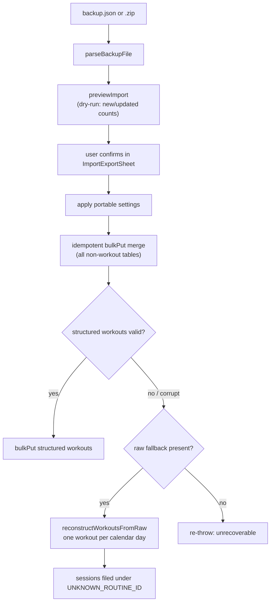

# Backup & Restore

Because everything is on-device, a single portable **`backup.json`** is the only way to safeguard or move data. The design has two safety nets: import is a **non-destructive merge** (idempotent, never deletes local-only data), and logged workouts — the one thing a user can't recreate by hand — travel twice: structured, and in a forgiving name-keyed raw form used as a reconstruction fallback.

> User-facing overview: [README — Data, Backup & Restore](../../README.md)

## What travels in a backup

`exportData` (`src/db/backup.ts:97`) reads every table in parallel and produces a `BackupFile` (`src/db/backup.ts:70`):

- **All domain tables**: exercises, routines, plans, workouts, measurement types/entries, analytics charts, and `progressionStates` (so [[concepts#c1RM|c1RM]] anchors survive a device move — restore does **not** re-derive them).
- **Portable settings**: the localStorage allowlist in `src/config/settings.ts` — `yafa:theme`, `yafa:weightUnit`, `yafa:lengthUnit`, and the two chart timeframes. Device/session state (notably the `yafa:activeWorkout` snapshot, see [[workout-tracking#Snapshot persistence|workout-tracking]]) is deliberately excluded.
- **`rawWorkouts`**: the redundancy payload — `exercise name → [{timestamp, reps, weight, rpe}]`, built by `buildRawWorkouts` (`src/db/rawWorkouts.ts:43`).

## Import pipeline

Stages, with anchors:

1. **Parse** — `parseBackupFile` (`src/db/backup.ts:422`) accepts `.json` or `.zip` (extracts `backup.json`).
2. **Preview** — `previewImport` (`src/db/backup.ts:300`) dry-runs the whole import: `diffEntities` (`src/db/backup.ts:278`) classifies each record as new/updated/unchanged by deep-equal, and the workout section reports one of four modes: `structured`, `reconstructed`, `unrecoverable`, or `empty` — the reconstruction is dry-run to count without writing.
3. **Merge** — `importData` (`src/db/backup.ts:184`) validates `app === "yafa"`, applies settings first, then upserts every non-workout table by id via `bulkPut`. Re-importing the same file (or one that overlaps existing data) never duplicates and never deletes.
4. **Workouts with fallback** — `importWorkouts` (internal, `src/db/backup.ts:221`): structured workouts are shape-checked by `assertStructuredWorkoutsValid` (`src/db/backup.ts:142`) — ids, timestamps, set shapes, and that every `exerciseId` resolves. On any validation failure (or a legacy backup with no structured list), it falls back to `reconstructWorkoutsFromRaw` (`src/db/rawWorkouts.ts:96`).

## Raw reconstruction semantics

`reconstructWorkoutsFromRaw` rebuilds what it can and is honest about what it can't:

- **Exercises** are matched by normalized name; missing ones are recreated with a default config and empty muscle groups.
- **Sets** are grouped into **one workout per local calendar day** — the raw form has no session boundaries, so a day is the safest unit.
- **Routines are unrecoverable** from raw data, so reconstructed sessions are filed under the `UNKNOWN_ROUTINE_ID` sentinel (`src/db/rawWorkouts.ts:36`).
- Days already present on the imported routine are skipped, keeping re-import idempotent.

## Merge semantics summary

| Entity                                                               | Keyed by                      | Conflict rule                                               |
| -------------------------------------------------------------------- | ----------------------------- | ----------------------------------------------------------- |
| Exercises, routines, plans, charts, measurements, progression states | `id`                          | `bulkPut` upsert — incoming wins, local-only rows untouched |
| Structured workouts                                                  | `id`                          | Upsert after shape validation                               |
| Reconstructed workouts                                               | exercise name + calendar day  | Skip days that already exist                                |
| Settings                                                             | allowlisted localStorage keys | Incoming wins                                               |

## What restore does NOT do

Restore never re-runs progression: `ProgressionState` travels as plain data, and no [[concepts#Fold|fold]] happens on import. If progression state is absent from a backup, anchors are re-seeded lazily from history the next time an exercise is prescribed/evaluated — see [[applying-results#History seeding and cold start|applying-results]].

## UI

`ImportExportSheet.vue` (opened from the sidebar, not the settings page) drives the flow: export button → file download; import → `parseBackupFile` → `previewImport` merge preview (new/updated counts, workout mode) → confirm → `importData` → reload so theme/units apply. Per-chart CSV export is separate and lives in [[analytics#CSV export|analytics]].

## Key functions

| Function                        | Anchor                     | Note                                      |
| ------------------------------- | -------------------------- | ----------------------------------------- |
| `exportData`                    | `src/db/backup.ts:97`      | Full export incl. settings + raw fallback |
| `importData`                    | `src/db/backup.ts:184`     | Idempotent merge entry point              |
| `previewImport`                 | `src/db/backup.ts:300`     | Dry-run diff + workout mode               |
| `assertStructuredWorkoutsValid` | `src/db/backup.ts:142`     | Gate between structured and raw paths     |
| `parseBackupFile`               | `src/db/backup.ts:422`     | `.json` / `.zip` handling                 |
| `buildRawWorkouts`              | `src/db/rawWorkouts.ts:43` | Structured → raw flattening at export     |
| `reconstructWorkoutsFromRaw`    | `src/db/rawWorkouts.ts:96` | Raw → one-workout-per-day recovery        |
