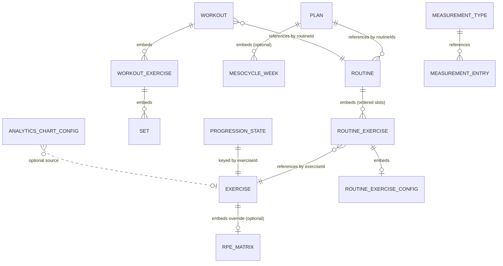

# Data Model

Everything the app stores lives in **IndexedDB via Dexie**, declared in `src/db/db.ts` with typed interfaces in `src/db/types.ts` and a centralized CRUD surface in `src/db/repository.ts`. App _preferences_ (theme, units, timeframes) live in localStorage under the `yafa:` namespace instead — see [[backup-restore#What travels in a backup|backup-restore]] for which of those are portable.

> User-facing overview: [README — Data, Backup & Restore](../../README.md)

## Stores and schema versions

Eight tables, evolved through ten schema versions. **Migration policy** (from CLAUDE.md): structural or required-field changes get a Dexie version + upgrade; read-time backfill (`normalizeProgressionParams`, see [[progression-models#Defaults and normalization|progression-models]]) is only a convenience for optional fields with safe defaults. Never edit an existing version — append a new one.

| Version | Change                                                                                                                                                                                 |
| ------- | -------------------------------------------------------------------------------------------------------------------------------------------------------------------------------------- |
| v1      | Initial stores: `exercises` (multi-entry index on muscle groups), `routines`, `plans`, `workouts`                                                                                      |
| v2      | `progressionStates` — per-exercise engine state                                                                                                                                        |
| v3      | `measurementTypes` + `measurementEntries` (body measurements)                                                                                                                          |
| v4      | `primaryMuscleGroup: string` → `primaryMuscleGroups: string[]` (upgrade rewrites every exercise)                                                                                       |
| v5      | `analyticsCharts` — user-configured chart configs                                                                                                                                      |
| v6      | Bodyweight feature removal (drops `bodyweightFactor`, `isSystem`)                                                                                                                      |
| v7      | Engine rewrite to derived-state reducer: adds `recalibrations`, clears `progressionStates`                                                                                             |
| v8      | Core engine teardown: drops `progressionStates` and `recalibrations`                                                                                                                   |
| v9      | Progression engine rebuild: re-introduces `progressionStates` keyed by `exerciseId` (c1RM anchor, streak, reset flag, double-rep cursor); rows created lazily                          |
| v10     | Session fatigue: stamps required `fatigueReduction` (10) / `fatigueReductionUnit` (`"percent"`) onto every stored routine config — the migration counterpart of the read-time backfill |

## Entity relationships

Embedded vs. referenced matters: routine slots and their configs are **embedded** in the routine document (hence read-time normalization instead of migrations for optional param fields), while plans → routines and workouts → routines are **id references** with integrity enforced in the repository layer, not the database.

## Key types

All in `src/db/types.ts`. The file's header comment states the pipeline these types serve: _config → mesocycle → prescription → execution → finish → c1RM update → next prescription_.

| Type                                   | Anchor                    | Meaning                                                                                                                                                                                                                  |
| -------------------------------------- | ------------------------- | ------------------------------------------------------------------------------------------------------------------------------------------------------------------------------------------------------------------------ |
| `Exercise`                             | `src/db/types.ts:84`      | Movement library entry: `primaryMuscleGroups`/`secondaryMuscleGroups` (drive [[fatigue-and-slots                                                                                                                         | fatigue]]), `notes`, optional `rpeMatrix` override (absent ⇒ inherits the global default)                                                |
| `RoutineExerciseConfig`                | `src/db/types.ts:94`      | Per-slot progression contract: `progressionModel`, `progressionParams`, `lockedFields?`. ⚠️ The loose top-level mirror fields (`targetSets`, `minReps`, …) are **vestigial** — the engine reads only `progressionParams` |
| `RoutineExercise`                      | `src/db/types.ts:108`     | One ordered slot: `exerciseId` + optional `config`; duplicates of the same exercise are distinct slots ([[concepts#Slot alignment                                                                                        | slot alignment]])                                                                                                                        |
| `Routine`                              | `src/db/types.ts:113`     | Ordered `exercises: RoutineExercise[]`, optional `weeklyTarget`                                                                                                                                                          |
| `PeriodizationFocus` / `MesocycleWeek` | `src/db/types.ts:121/127` | Week focus; kept as an object `{focus}` so per-week tuning can be added without migration                                                                                                                                |
| `Plan`                                 | `src/db/types.ts:131`     | `routineIds: string[]`, `active` (single-active invariant), optional `mesocycle: MesocycleWeek[]`                                                                                                                        |
| `Set`                                  | `src/db/types.ts:145`     | Logged set: `targetReps/actualReps`, `targetWeight/actualWeight`, `targetRpe?/actualRpe?`, `failure`, `timestamp`                                                                                                        |
| `WorkoutExercise` / `Workout`          | `src/db/types.ts:157/165` | Session record: `routineId`, `startTime`, `endTime?`, exercises with sets                                                                                                                                                |
| `ProgressionState`                     | `src/db/types.ts:179`     | The engine's persisted row per exercise: `c1rm` ([[concepts#c1RM                                                                                                                                                         | unrounded anchor]], null until seeded), `regressionStreak`, `resetPending`, `doubleRepCursor?`, `lastWorkoutId` (fold idempotency guard) |
| `RpeMatrix`                            | `src/db/types.ts:82`      | `Record<reps, Record<rpe, pctOf1RM>>`, decimals 0–1 — see [[rpe-matrix]]                                                                                                                                                 |
| `MeasurementType` / `MeasurementEntry` | `src/db/types.ts:198/205` | Body measurements; values stored in source-of-truth units (kg/cm/%) — imperial never reaches the DB                                                                                                                      |
| `AnalyticsChartConfig`                 | `src/db/types.ts:231`     | Chart definition: `sourceKind` (`global`/`muscle`/`exercise`/`measurement`), flat optional source fields (exactly one set, kept flat for Dexie), `metric`, `bucket`, `order`                                             |

`ProgressionState` is **persisted rather than derived** on purpose: percentage-based increments and −10% resets make the c1RM path-dependent, so it can't be recomputed cheaply from history. The analytics-side [[concepts#Implied e1RM|implied e1RM]] is never stored here.

## Repository layer

`src/db/repository.ts` is the single CRUD gate — consistent ids (`crypto.randomUUID`), timestamps, and **cascades so no orphaned references survive**:

| Invariant                                                                    | Function(s)                                                                                                                                                                                                         |
| ---------------------------------------------------------------------------- | ------------------------------------------------------------------------------------------------------------------------------------------------------------------------------------------------------------------- |
| Only one plan active at a time                                               | `createPlan` (`repository.ts:47`), `setPlanActive` (`repository.ts:96`) — both deactivate all others in a transaction                                                                                               |
| Mesocycle persisted separately from name/description                         | `setPlanMesocycle` (`repository.ts:84`) — strips Vue proxies; empty list clears periodization                                                                                                                       |
| Deleting a plan removes only _exclusively-owned_ routines                    | `deletePlan` (`repository.ts:117`) — computes which routines are referenced elsewhere                                                                                                                               |
| Deleting a routine strips its id from every plan                             | `deleteRoutine` (`repository.ts:184`)                                                                                                                                                                               |
| Deleting an exercise strips every routine slot **and** its progression state | `deleteExercise` (`repository.ts:271`), warned by `countExerciseUsage` (`repository.ts:260`)                                                                                                                        |
| Progression state reads never persist defaults                               | `getProgressionState` (`repository.ts:327`) returns a fresh blank row (`freshProgressionState`, `repository.ts:311`) if none stored; only `putProgressionState` (`repository.ts:341`) writes, stamping `updated_at` |

The engine's only persistence surface is that last pair — everything else in the engine is pure (see [[prescription-pipeline]]).

## Seeding

`src/db/seed.ts` runs once when the database is empty: a starter exercise library, three routines with fully-specified configs, one active plan with a 6-week mesocycle (Hypertrophy ×2, Strength ×2, Peaking, Deload), a "Bodyweight" measurement type, and a default chart. `devSeed.ts` is a separate dev-only fixture. A different kind of seeding — deriving an initial c1RM from workout history (`seedC1rmFromHistory`, `src/engine/sessions.ts:61`) — belongs to the engine; see [[applying-results#History seeding and cold start|applying-results]].

## Key functions

| Function              | Anchor                     | Note                                         |
| --------------------- | -------------------------- | -------------------------------------------- |
| `setPlanActive`       | `src/db/repository.ts:96`  | Single-active-plan transaction               |
| `setPlanMesocycle`    | `src/db/repository.ts:84`  | Proxy-stripping meso persistence             |
| `deletePlan`          | `src/db/repository.ts:117` | Orphan-only routine cascade                  |
| `deleteExercise`      | `src/db/repository.ts:271` | Slot + progression-state cascade             |
| `getProgressionState` | `src/db/repository.ts:327` | Read-or-default, never persists              |
| `putProgressionState` | `src/db/repository.ts:341` | The engine's only write path for progression |
| v10 fatigue migration | `src/db/db.ts:118`         | Latest schema upgrade                        |
| `seedDatabase`        | `src/db/seed.ts:423`       | First-run seed, only when empty              |
