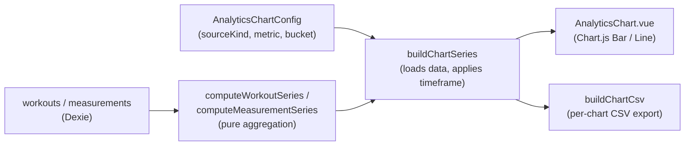

# Analytics

Everything in `src/analytics/` is a **read-only view over history**. The firewall invariant comes first because it shapes the whole module: [[concepts#Adherence|adherence]] scores, PRs, and chart aggregations **never feed progression** — c1RM moves only through the deterministic rules in [[applying-results]]. Analytics may reuse engine _math_ (`impliedE1rm`, `isQualifyingSet`, the `comparison.ts` deviation helpers) but never engine _state transitions_.

## Chart pipeline

- **Config** — `AnalyticsChartConfig` ([[data-model#Key types|data-model]]): a source (`global` | `muscle` | `exercise` | `measurement`), a metric (`workouts` | `sets` | `reps` | `volume` | `e1rm` | `value`), and a bucket (`session` | `week` | `month` | `mesocycle`). CRUD + drag-ordering in `src/db/analyticsCharts.ts`.
- **Aggregation core** — `computeWorkoutSeries` (`src/analytics/compute.ts:214`), pure: buckets history, computes the metric per bucket, omits empty buckets (never zero-fills). e1RM buckets take the **max** qualifying [[concepts#Implied e1RM|implied e1RM]]. Muscle-scoped charts attribute work fractionally: `DIRECT_MULTIPLIER` (1.0) for primary muscles, `INDIRECT_MULTIPLIER` (0.5) for secondary — a charting attribution scheme, _not_ the fatigue tier ladder ([[fatigue-and-slots#Not to be confused with analytics multipliers|fatigue-and-slots]]). Measurement charts average entries per bucket (`computeMeasurementSeries`, `compute.ts:377`).
- **Loader** — `buildChartSeries(config, timeframe)` (`src/analytics/service.ts:68`) is the only Dexie-touching analytics layer: applies the trailing-window timeframe, resolves the active plan's mesocycle for mesocycle bucketing (`activeMesocycleSpec`, `src/analytics/service.ts:57`), and dispatches to the pure core.
- **Rendering** — `AnalyticsChart.vue` (tree-shaken Chart.js; stacked bars show direct solid / indirect translucent; tooltips get a "full math" breakdown from `presentation.ts`). `AnalyticsPage.vue` hosts the chart list in a `liveQuery` so charts update as data changes, with a persisted global timeframe toggle.

## Workout summary, adherence and PRs

Built by `buildWorkoutSummary` (`src/analytics/service.ts:133`) → `computeWorkoutSummary` (`src/analytics/summary.ts:285`), **before** the workout persists — ordering owned by [[workout-tracking#Finish ordering|workout-tracking]]. Rendered by `WorkoutSummarySheet.vue` (hero gauge, PR highlights, calibration list).

**Adherence** — `computeAdherence` (internal, `summary.ts:127`) scores 0–100 with penalty weights from `ADHERENCE_WEIGHTS` (`summary.ts:88`): per-set deviations (RPE overshoot — undershoot is free —, rep deviation, weight deviation beyond the ±2.5 kg dead zone) averaged over judged sets, plus absolute counts for missing/trashed sets. Deviations reuse the `comparison.ts` helpers, so "on prescription" here means exactly what it means in evaluation ([[applying-results#Evaluation semantics|applying-results]]). The `SummaryHero` gauge colors green > 90, amber 75–89, red < 75, with a "Why not 100%?" deduction breakdown.

**PRs** — `detectPrs` (internal, `summary.ts:223`): an e1RM PR when the session's `peakImpliedE1rm` beats the historical best (qualifying sets only), and a volume PR when session tonnage beats history. History deliberately excludes the current session.

**Calibrations** — the summary also lists the `CalibrationChange[]` returned by the fold (seed → "Calibrated", increment → "Progressed", recalibrate → "Recalibrated", armed reset → "Deload armed · next session −10%"), giving the user a faithful account of what [[applying-results]] just did.

## History and routine stats

- `groupByWeek` (`src/analytics/history.ts:29`) — week-of-month grouping for the history page (display-only).
- `computeRoutineStats` (`src/analytics/routineStats.ts:10`) — per-routine this-week count and "last performed" label; drives the dashboard's weekly-target indicator.
- `presentation.ts` — pure labels/titles/tooltip text; chart type selection (`chartTypeFor`: bar, stacked bar, or line).

## CSV export

Any chart exports to CSV (`AnalyticsChartCard.vue` → `buildChartCsv`, `src/analytics/chartCsv.ts:45`): the file lists the chart's configuration, a per-period value table whose columns adapt to the chart type (stacked bars get Direct/Indirect/Total; e1RM lines get best-set context), and a step-by-step guide (`chartGuideLines`, `chartCsvText.ts`) for rebuilding the chart in Excel or Google Sheets. Exports always span full history while keeping the configured bucket; units follow the user's display units.

## Key functions

| Function                      | Anchor                             | Note                                       |
| ----------------------------- | ---------------------------------- | ------------------------------------------ |
| `computeWorkoutSeries`        | `src/analytics/compute.ts:214`     | Pure bucket/metric aggregation             |
| `computeMeasurementSeries`    | `src/analytics/compute.ts:377`     | Bucket-averaged measurements               |
| `buildChartSeries`            | `src/analytics/service.ts:68`      | Dexie loader + timeframe window            |
| `buildWorkoutSummary`         | `src/analytics/service.ts:133`     | Summary loader (excludes current session)  |
| `computeWorkoutSummary`       | `src/analytics/summary.ts:285`     | Duration / sets / volume / adherence / PRs |
| `computeAdherence` (internal) | `src/analytics/summary.ts:127`     | Weighted penalties, analytics-only         |
| `detectPrs` (internal)        | `src/analytics/summary.ts:223`     | e1RM + volume PRs                          |
| `buildChartCsv`               | `src/analytics/chartCsv.ts:45`     | Config + table + rebuild guide             |
| `computeRoutineStats`         | `src/analytics/routineStats.ts:10` | Dashboard weekly stats                     |
