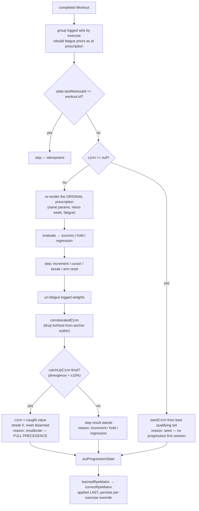
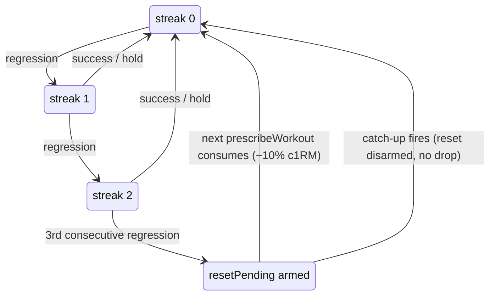

# Applying Workout Results

The [[concepts#Fold|fold]]: after a workout persists, `applyWorkoutResults` (`src/engine/service.ts:549`) turns each exercise's logged sets into exactly **one c1RM move** — an increment, a hold, a regression mark, a recalibration jump, or a first-time seed — plus, last of all, an RPE-matrix learning step. This is the densest doc in the set; the deterministic rules here are locked design decisions.

> User-facing overview: [README — Progression Models / Regression Tracking & Reset](../../README.md)

## The fold

The whole fold runs in one `[progressionStates, exercises]` transaction and returns `CalibrationChange[]` (`src/engine/service.ts:98`) — the before/after list the summary sheet renders. Sets logged for exercises _not_ in the routine just get stamped with `lastWorkoutId` (no progression off-script).

Two subtleties worth naming:

- **Evaluate against the original prescription.** The baseline is re-rendered from the same params, mesocycle week (as of `workout.startTime`, not "now"), and fatigue priors that produced the session's prescription — so an in-session green-dot adjustment _down_ can't disguise a miss, and a fatigue reduction is judged as prescribed.
- **Un-fatigue before corroborating.** Logged weights are divided by the fatigue scale before computing demonstrated e1RMs, so a session-transient reduction can't false-trigger the catch-up ([[fatigue-and-slots#Slot priors|fatigue-and-slots]]).

## Evaluation semantics

`evaluate(model, params, prescription, loggedSets)` (`src/engine/evaluation.ts:55`) is the only place the success/hold/regression rules live (`ProgressionOutcome`, `evaluation.ts:32`). Cross-cutting rules:

- **Worst set decides a regression; success needs every set.** The worst set is the hardest one: highest RPE, tie-broken by fewest reps. (Top-set model: only the top set judges.)
- **Missing RPE falls through to hold** — a set logged without RPE can neither confirm success nor trigger a regression.
- **"At the prescribed weight" is delegated** to `weightMatches` (`src/engine/comparison.ts:13`, ±`PRESCRIBED_WEIGHT_TOLERANCE_KG`, currently 2.5 kg). `comparison.ts` is the **single source of truth** for prescribed-vs-actual — evaluation, the green-dot adjustment, and adherence analytics all use its helpers (`weightDeviationKg/Pct`, `rpeOvershoot` — undershoot never penalized, `repsDeviation`), so they can never disagree about what "on prescription" means.

Per-model criteria are summarized in the [[progression-models#Per-model behavior matrix|behavior matrix]]; the per-model implementations sit at `evaluation.ts:86` (linear), `:120` (double), `:155` (top set).

## State transitions

`step(state, outcome, model, params, workoutId, now)` (`src/engine/state.ts:113`) maps the outcome onto `ProgressionState`:

| Outcome    | c1RM                                                                                          | Streak                                                    | Double cursor                      |
| ---------- | --------------------------------------------------------------------------------------------- | --------------------------------------------------------- | ---------------------------------- |
| success    | `applyIncrement` (`state.ts:62` — flat kg, or compounding percent of current c1RM; unrounded) | cleared                                                   | back to `minReps`                  |
| hold       | unchanged                                                                                     | cleared                                                   | advances one step toward `maxReps` |
| regression | **unchanged**                                                                                 | +1; at `REGRESSION_RESET_TRIGGER` (3) arms `resetPending` | unchanged                          |

`step` never consumes resets — that's the prescription's job ([[prescription-pipeline#Reset consumption|prescription-pipeline]]).

## Two-phase reset

Mechanics home for [[concepts#Two-phase reset|two-phase reset]] (this doc owns _arming_; consumption is linked above):

A regression never changes load on the spot — one bad day can't derail progression. The −10% drop is the **fallback for sustained, small regressions** that stay inside the catch-up band; when demonstrated capacity has clearly moved (beyond ±10%), the catch-up overrides the bookkeeping entirely.

## Catch-up

Mechanics home for [[concepts#Catch-up|catch-up]] and [[concepts#Demonstrated e1RM|demonstrated e1RM]]. Because c1RM normally nudges one increment per success, it can fall far behind (or ahead of) true capacity — after a layoff, a peak, or a mis-seeded anchor. Correction happens in two pure steps:

1. **Corroborate** — `corroboratedE1rm(sessionE1rms, anchor)` (`src/engine/state.ts:176`): from this session's qualifying implied e1RMs, drop the single furthest-from-anchor value as a possible fluke and use the next-furthest; a lone qualifying set (top-set programs) is used directly.
2. **Close the gap** — `catchUpC1rm(c1rm, estimate)` (`state.ts:195`): inside ±`CATCHUP_THRESHOLD` (10%) the anchor is returned unchanged (the caller's signal that nothing fired); outside it, c1RM jumps `CATCHUP_CLOSE_FRACTION` (70%) of the gap in one move — fast convergence, not a per-session nibble, in either direction.

When it fires, `foldQualifiedSession` (internal, `src/engine/service.ts:323`) gives it **full precedence**: the caught value replaces whatever `step` computed, the streak clears, the pending reset disarms, and the calibration reason becomes `recalibrate`.

How the three correction mechanisms divide the space:

| Mechanism                        | Trigger band        | What moves                | Precedence                    |
| -------------------------------- | ------------------- | ------------------------- | ----------------------------- |
| Increment (via `step`)           | on success          | c1RM by `weightIncrement` | default                       |
| Catch-up                         | divergence > ±10%   | c1RM by 70% of the gap    | overrides step, streak, reset |
| [[concepts#RPE matrix correction | Matrix correction]] | deviation ≤ 5%            | the curve's _shape_, not c1RM | runs last, never conflicts |

## Ordering invariants

1. **Summary before fold** — `finishWorkout` builds the summary before persisting/folding so PR history excludes the session and adherence sees pre-learning matrices ([[workout-tracking#Finish ordering|workout-tracking]]).
2. **One c1RM move per session** — seed, increment, or recalibrate; never a combination. Idempotency guard: `lastWorkoutId`.
3. **Matrix correction last** — `learnedRpeMatrix` (internal, `src/engine/service.ts:389`) runs after prescription, evaluation, and catch-up, so learning only shapes _future_ sessions. It gates on deviation ≤ `RPE_MATRIX_CORRECTION_MAX_DEVIATION` (5%) and anchors on the stable pre-catch-up c1RM; the math lives in [[rpe-matrix#Adaptive correction|rpe-matrix]].
4. **c1RM stays unrounded** — only rendered weights snap ([[concepts#Loadable increment|loadable increment]]).
5. **Adherence never feeds progression** — the analytics firewall ([[analytics]]).
6. **Slot-aligned grouping** — duplicate slots fold with the correct fatigue baselines ([[concepts#Slot alignment|slot alignment]]).

## History seeding and cold start

The first session for an exercise seeds rather than progresses: `seedC1rm` (internal, `src/engine/service.ts:299`) takes the best [[concepts#Qualifying set|qualifying]] set (fallback: best usable set), and the fold stops there — reason `seed`, no evaluation. Separately, `seedC1rmFromHistory` (`src/engine/sessions.ts:61`) can derive an anchor from full workout history (peak honest e1RM across all sessions) — relevant after an import without progression states ([[backup-restore#What restore does NOT do|backup-restore]]). `groupSessionsFor` (`sessions.ts:24`) is the shared history-flattening helper the fold uses to gather a session's sets.

## Key functions

| Function                                      | Anchor                                                    | Note                                           |
| --------------------------------------------- | --------------------------------------------------------- | ---------------------------------------------- |
| `applyWorkoutResults`                         | `src/engine/service.ts:549`                               | The fold entrypoint; transactional, idempotent |
| `foldQualifiedSession` (internal)             | `src/engine/service.ts:323`                               | One-move-per-session logic                     |
| `evaluate`                                    | `src/engine/evaluation.ts:55`                             | Outcome dispatch (`:86/:120/:155`)             |
| `step`                                        | `src/engine/state.ts:113`                                 | Outcome → state transition                     |
| `applyIncrement`                              | `src/engine/state.ts:62`                                  | kg flat / percent compounding                  |
| `corroboratedE1rm`                            | `src/engine/state.ts:176`                                 | Drop-furthest corroboration                    |
| `catchUpC1rm`                                 | `src/engine/state.ts:195`                                 | ±10% gate, 70% close                           |
| `weightMatches`                               | `src/engine/comparison.ts:13`                             | ±2.5 kg single source of truth                 |
| `learnedRpeMatrix` (internal)                 | `src/engine/service.ts:389`                               | ≤5% gate before matrix learning                |
| `seedC1rm` (internal) / `seedC1rmFromHistory` | `src/engine/service.ts:299` / `src/engine/sessions.ts:61` | Cold-start vs. history seeding                 |
| `groupSessionsFor`                            | `src/engine/sessions.ts:24`                               | History → per-exercise sessions                |

The integration test `src/engine/__tests__/loop.spec.ts` exercises this entire chain (prescribe → evaluate → step → catch-up → matrix correction) without Dexie and is the best executable specification of the rules above.
