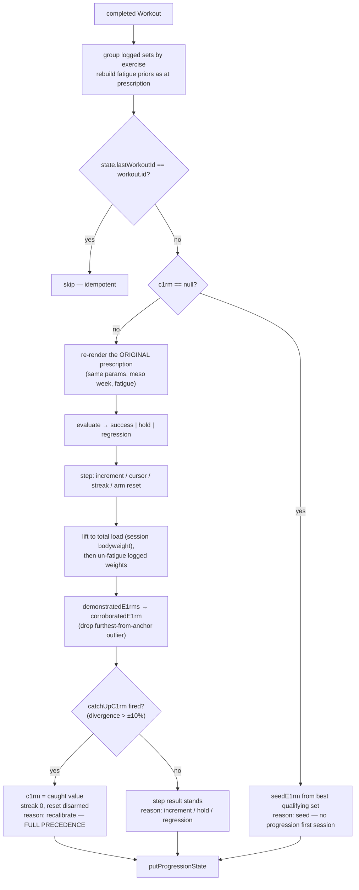
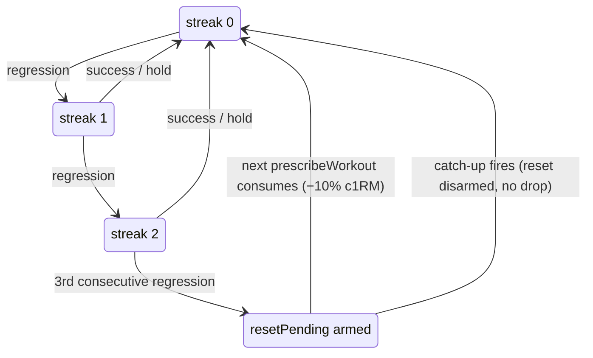

# Applying Workout Results

The [[concepts#Fold|fold]]: after a workout persists, `applyWorkoutResults` (`src/engine/service.ts`) turns each exercise's logged sets into exactly **one c1RM move** — an increment, a hold, a regression mark, a recalibration jump, or a first-time seed. This is the densest doc in the set; the deterministic rules here are locked design decisions.

> User-facing overview: [README — Progression Models / Regression Tracking & Reset](../../README.md)

## The fold

```mermaid
flowchart TD
    WK["completed Workout"] --> GROUP["group logged sets by exercise<br/>rebuild fatigue priors as at prescription"]
    GROUP --> GUARD{"state.lastWorkoutId == workout.id?"}
    GUARD -->|yes| SKIP["skip — idempotent"]
    GUARD -->|no| COLD{"c1rm == null?"}
    COLD -->|yes| SEED["seedE1rm from best qualifying set<br/>reason: seed — no progression first session"]
    COLD -->|no| RERENDER["re-render the ORIGINAL prescription<br/>(same params, meso week, fatigue)"]
    RERENDER --> EVAL["evaluate → success | hold | regression"]
    EVAL --> STEP["step: increment / cursor / streak / arm reset"]
    STEP --> UNFAT["lift to total load (session bodyweight),<br/>then un-fatigue logged weights"]
    UNFAT --> CORR["demonstratedE1rms → corroboratedE1rm<br/>(drop furthest-from-anchor outlier)"]
    CORR --> CATCH{"catchUpC1rm fired?<br/>(divergence > ±10%)"}
    CATCH -->|yes| RECAL["c1rm = caught value<br/>streak 0, reset disarmed<br/>reason: recalibrate — FULL PRECEDENCE"]
    CATCH -->|no| KEEP["step result stands<br/>reason: increment / hold / regression"]
    RECAL --> PUT["putProgressionState"]
    KEEP --> PUT
    SEED --> PUT
```

The whole fold runs in one `progressionStates` transaction and returns `CalibrationChange[]` (`src/engine/service.ts`) — the before/after list the summary sheet renders. Sets logged for exercises _not_ in the routine just get stamped with `lastWorkoutId` (no progression off-script).

Three subtleties worth naming:

- **Evaluate against the original prescription.** The baseline is re-rendered from the same params, mesocycle week (as of `workout.startTime`, not "now"), and fatigue priors that produced the session's prescription — so an in-session green-dot adjustment _down_ can't disguise a miss, and a fatigue reduction is judged as prescribed. Evaluation compares **added weights** on both sides, so any [[concepts#Bodyweight offset|bodyweight offset]] cancels.
- **Lift, then un-fatigue.** Before any e1RM math, logged sets are lifted into total-load space with the **session-time** bodyweight (`total = (added + offset) ÷ fatigueScale` — the transforms don't commute; see [[bodyweight]]), then divided by the fatigue scale so a session-transient reduction can't false-trigger the catch-up ([[fatigue-and-slots#Slot priors|fatigue-and-slots]]).
- **Session-time bodyweight.** The fold uses the bodyweight in effect at `workout.startTime`, not today's — re-running a fold always reproduces the same result.

## Evaluation semantics

`evaluate(model, params, prescription, loggedSets)` (`src/engine/evaluation.ts`) is the only place the success/hold/regression rules live (`ProgressionOutcome`, `evaluation.ts`). Cross-cutting rules:

- **Worst set decides a regression; success needs every set.** The worst set is the hardest one: highest RPE, tie-broken by fewest reps. (Top-set model: only the top set judges.)
- **Missing RPE falls through to hold** — a set logged without RPE can neither confirm success nor trigger a regression.
- **"At the prescribed weight" is delegated** to `weightMatches` (`src/engine/comparison.ts`, ±`PRESCRIBED_WEIGHT_TOLERANCE_KG`, currently 2.5 kg). `comparison.ts` is the **single source of truth** for prescribed-vs-actual: evaluation and the green-dot adjustment both judge through it, so they can never disagree about what "on prescription" means. Adherence no longer judges deviations at all, so it no longer reads from here.

Per-model criteria are summarized in the [[progression-models#Per-model behavior matrix|behavior matrix]]; the per-model implementations live alongside `evaluate` in `src/engine/evaluation.ts`.

## State transitions

`step(state, outcome, model, params, workoutId, now)` (`src/engine/state.ts`) maps the outcome onto `ProgressionState`:

| Outcome    | c1RM                                                                                       | Streak                                                    | Double cursor                      |
| ---------- | ------------------------------------------------------------------------------------------ | --------------------------------------------------------- | ---------------------------------- |
| success    | `applyIncrement` (`state.ts` — flat kg, or compounding percent of current c1RM; unrounded) | cleared                                                   | back to `minReps`                  |
| hold       | unchanged                                                                                  | cleared                                                   | advances one step toward `maxReps` |
| regression | **unchanged**                                                                              | +1; at `REGRESSION_RESET_TRIGGER` (3) arms `resetPending` | unchanged                          |

`step` never consumes resets — that's the prescription's job ([[prescription-pipeline#Reset consumption|prescription-pipeline]]).

## Two-phase reset

Mechanics home for [[concepts#Two-phase reset|two-phase reset]] (this doc owns _arming_; consumption is linked above):

```mermaid
stateDiagram-v2
    state "streak 0" as S0
    state "streak 1" as S1
    state "streak 2" as S2
    state "resetPending armed" as ARMED
    S0 --> S1: regression
    S1 --> S2: regression
    S2 --> ARMED: 3rd consecutive regression
    S1 --> S0: success / hold
    S2 --> S0: success / hold
    ARMED --> S0: next prescribeWorkout consumes (−10% c1RM)
    ARMED --> S0: catch-up fires (reset disarmed, no drop)
```

A regression never changes load on the spot — one bad day can't derail progression. The −10% drop is the **fallback for sustained, small regressions** that stay inside the catch-up band; when demonstrated capacity has clearly moved (beyond ±10%), the catch-up overrides the bookkeeping entirely.

## Catch-up

Mechanics home for [[concepts#Catch-up|catch-up]] and [[concepts#Demonstrated e1RM|demonstrated e1RM]]. Because c1RM normally nudges one increment per success, it can fall far behind (or ahead of) true capacity — after a layoff, a peak, or a mis-seeded anchor. Correction happens in two pure steps:

1. **Corroborate** — `corroboratedE1rm(sessionE1rms, anchor)` (`src/engine/state.ts`): from this session's qualifying implied e1RMs, drop the single furthest-from-anchor value as a possible fluke and use the next-furthest; a lone qualifying set (top-set programs) is used directly.
2. **Close the gap** — `catchUpC1rm(c1rm, estimate)` (`state.ts`): inside ±`CATCHUP_THRESHOLD` (10%) the anchor is returned unchanged (the caller's signal that nothing fired); outside it, c1RM jumps in one move — `CATCHUP_CLOSE_UP` (70%) of the gap when capacity ran ahead, `CATCHUP_CLOSE_DOWN` (100%) when it fell, landing on the estimate. The threshold is symmetric, the close is not: an anchor that is too low costs easy sessions, one that is too high costs the session itself.

When it fires, `foldSession` (`src/engine/fold.ts`) gives it **full precedence**: the caught value replaces whatever `step` computed, the streak clears, the pending reset disarms, and the calibration reason becomes `recalibrate`.

How the two correction mechanisms divide the space:

| Mechanism              | Trigger band      | What moves                           | Precedence                    |
| ---------------------- | ----------------- | ------------------------------------ | ----------------------------- |
| Increment (via `step`) | on success        | c1RM by `weightIncrement`            | default                       |
| Catch-up               | divergence > ±10% | c1RM by 70% of the gap up, 100% down | overrides step, streak, reset |

## Ordering invariants

1. **Summary before fold** — `finishWorkout` builds the summary before persisting/folding so PR history excludes the session ([[workout-tracking#Finish ordering|workout-tracking]]).
2. **One c1RM move per session** — seed, increment, or recalibrate; never a combination. Idempotency guard: `lastWorkoutId`.
3. **The fold never writes the RPE matrix** — the matrix is static data that only a hand edit changes, so a session can never reshape the curve it was prescribed from ([[rpe-matrix#Manual editing|rpe-matrix]]).
4. **c1RM stays unrounded** — only rendered weights snap ([[concepts#Loadable increment|loadable increment]]).
5. **Adherence never feeds progression** — the analytics firewall ([[analytics]]).
6. **Slot-aligned grouping** — duplicate slots fold with the correct fatigue baselines ([[concepts#Slot alignment|slot alignment]]).

## History seeding and cold start

The first session for an exercise seeds rather than progresses: `seedE1rm` (`src/engine/matrix.ts`) takes the best [[concepts#Qualifying set|qualifying]] set (fallback: best usable set), and the fold stops there — reason `seed`, no evaluation. That one helper is the whole seeding policy: the cold-start fold, the live mid-session anchor (`liveEffectiveE1rm`, `state.ts`), and `seedC1rmFromHistory` (`src/engine/sessions.ts`) all seed through it, so relaxing the fallback can never move one without the others. `seedC1rmFromHistory` derives an anchor from full workout history (peak honest e1RM across all sessions) — relevant after an import without progression states ([[backup-restore#What restore does NOT do|backup-restore]]).

## Key functions

| Function                           | File                                              | Note                                                            |
| ---------------------------------- | ------------------------------------------------- | --------------------------------------------------------------- |
| `applyWorkoutResults`              | `src/engine/service.ts`                           | The fold entrypoint; transactional, idempotent                  |
| `foldSession`                      | `src/engine/fold.ts`                              | One-move-per-session logic                                      |
| `evaluate`                         | `src/engine/evaluation.ts`                        | Outcome dispatch; `regressedAt` is the shared regression clause |
| `step`                             | `src/engine/state.ts`                             | Outcome → state transition                                      |
| `applyIncrement`                   | `src/engine/state.ts`                             | kg flat / percent compounding                                   |
| `corroboratedE1rm`                 | `src/engine/state.ts`                             | Drop-furthest corroboration                                     |
| `catchUpC1rm`                      | `src/engine/state.ts`                             | ±10% gate; 70% close up, 100% down                              |
| `weightMatches`                    | `src/engine/comparison.ts`                        | ±2.5 kg single source of truth                                  |
| `seedE1rm` / `seedC1rmFromHistory` | `src/engine/matrix.ts` / `src/engine/sessions.ts` | Shared seeding gate; history seeding wraps it                   |
| `demonstratedE1rms`                | `src/engine/fold.ts`                              | Qualifying sets lifted + un-fatigued, once                      |

The integration test `src/engine/__tests__/loop.spec.ts` exercises this entire chain (prescribe → evaluate → step → catch-up) without Dexie and is the best executable specification of the rules above.
