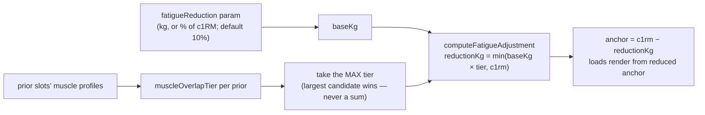

# Session Fatigue & Slot Alignment

Exercises later in a session don't start fresh. YAFA models this with a **transient, muscle-overlap-based reduction** shaved off the anchor before loads render ([[concepts#Session fatigue|session fatigue]]) — and that single feature forces a structural invariant across the whole codebase: [[concepts#Slot alignment|slot alignment]].

> User-facing overview: [README — Session Fatigue Reduction](../../README.md)

## Why slots, not exercise ids

The same exercise can appear in multiple slots of one routine, and because fatigue depends on _what came before_, those slots prescribe **different loads**. So prescriptions are arrays aligned to routine slot positions, and every consumer — `useActiveWorkout`, the tracker's cards, the localStorage snapshot, evaluation's set grouping — preserves that positional alignment. Folding by `exerciseId` would silently collapse duplicate slots and mis-render loads. This is the one invariant most likely to bite a refactor; `prescribeWorkout`'s contract comment in `src/engine/service.ts` states it explicitly.

## Muscle overlap tiers

Fatigue is **purely muscle-overlap based** — an RPE-driven scaling was considered and discarded. Each exercise declares `primaryMuscleGroups` / `secondaryMuscleGroups` (picked in the exercise form); `muscleProfileOf` (`src/engine/service.ts`) turns that into a `MuscleProfile`, and `muscleOverlapTier` (`src/engine/fatigue.ts`) scores the overlap between the current exercise and one prior — weighing the **current** exercise's role heavier:

| Current exercise's muscle | Prior exercise's muscle | Tier |
| ------------------------- | ----------------------- | ---- |
| primary                   | primary                 | 100% |
| primary                   | secondary               | 75%  |
| secondary                 | primary                 | 50%  |
| secondary                 | secondary               | 25%  |
| no overlap                | —                       | 0    |

## Adjustment computation

`computeFatigueAdjustment` (`src/engine/fatigue.ts`) returns null when the reduction is disabled (0) or c1RM is unseeded. The exercise's `fatigueReduction` param (per-model, configured in the Advanced section of the config sheet; kg or percent of c1RM via `fatigueReductionUnit`) is the **maximum** reduction; the overlap tier scales it down. Candidates from multiple priors are never summed — the largest single candidate wins.

The reduction subtracts from the **anchor**, not from individual set weights, so one multiplicative scale covers straight, top, and back-off sets alike. It is session-transient: the prescription echoes the _unreduced_ `c1rm` alongside the `fatigueReduction` applied, and the stored [[concepts#c1RM|c1RM]] never moves because of fatigue.

## Slot priors

`priorsBySlot(exerciseIds, exerciseOf)` (`src/engine/service.ts`) accumulates, for each slot, the muscle profiles of every earlier slot — which is why routine order is load-bearing ([[plans-and-routines#Exercise order is load-bearing|plans-and-routines]]) and why the preview already shows the reduced loads: priors are known at prescription time, not discovered mid-session. A repeated exercise counts as its own prior.

Two symmetry guarantees downstream:

- **Preview = prescription**: `previewWorkout` and `prescribeWorkout` build priors identically, so what you preview is what you get ([[prescription-pipeline]]).
- **Evaluation sees the same baseline**: `applyWorkoutResults` rebuilds the same priors and _un-fatigues_ logged weights before computing demonstrated e1RMs, so a fatigue reduction can't masquerade as a strength change and false-trigger the catch-up ([[applying-results#Catch-up|applying-results]]). For bodyweight exercises, sets are lifted to total load _before_ un-fatiguing — the transforms don't commute ([[bodyweight]]).

Even with fatigue applied, a [[concepts#Green dot|green-dot]] proposal can still surface mid-session if demonstrated capacity differs materially from the prescribed load ([[workout-tracking#Green dot represcription|workout-tracking]]).

## Not to be confused with analytics multipliers

Analytics attributes volume to muscles with its own constants — `DIRECT_MULTIPLIER` (1.0) / `INDIRECT_MULTIPLIER` (0.5) in `src/analytics/compute.ts` ([[analytics#Chart pipeline|analytics]]). That's a charting attribution scheme, unrelated to the fatigue tier ladder above.

## Key functions

| Function                         | File                    | Note                              |
| -------------------------------- | ----------------------- | --------------------------------- |
| `muscleOverlapTier`              | `src/engine/fatigue.ts` | The 100/75/50/25 ladder           |
| `computeFatigueAdjustment`       | `src/engine/fatigue.ts` | Max-not-sum, capped at c1RM       |
| `muscleProfileOf`                | `src/engine/service.ts` | Exercise → `MuscleProfile`        |
| `priorsBySlot`                   | `src/engine/service.ts` | Positional prior accumulation     |
| `fatigueReductionFor` (internal) | `src/engine/service.ts` | Wires params + priors per slot    |
| `fatigueScaleOf` (internal)      | `src/engine/service.ts` | Un-fatiguing scale for evaluation |
