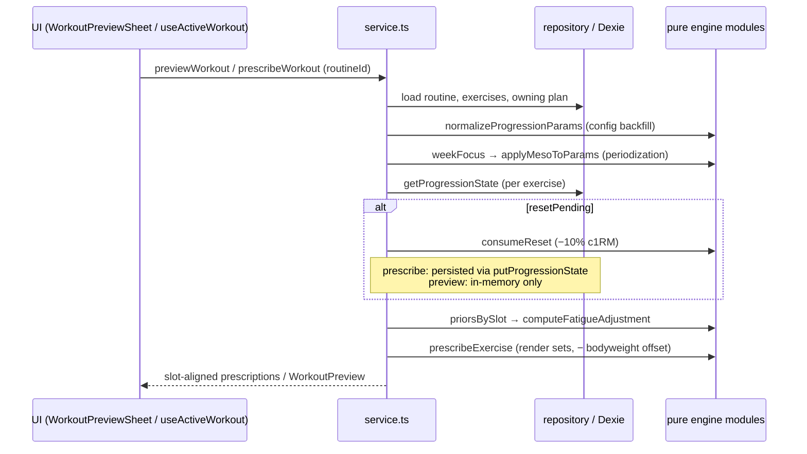
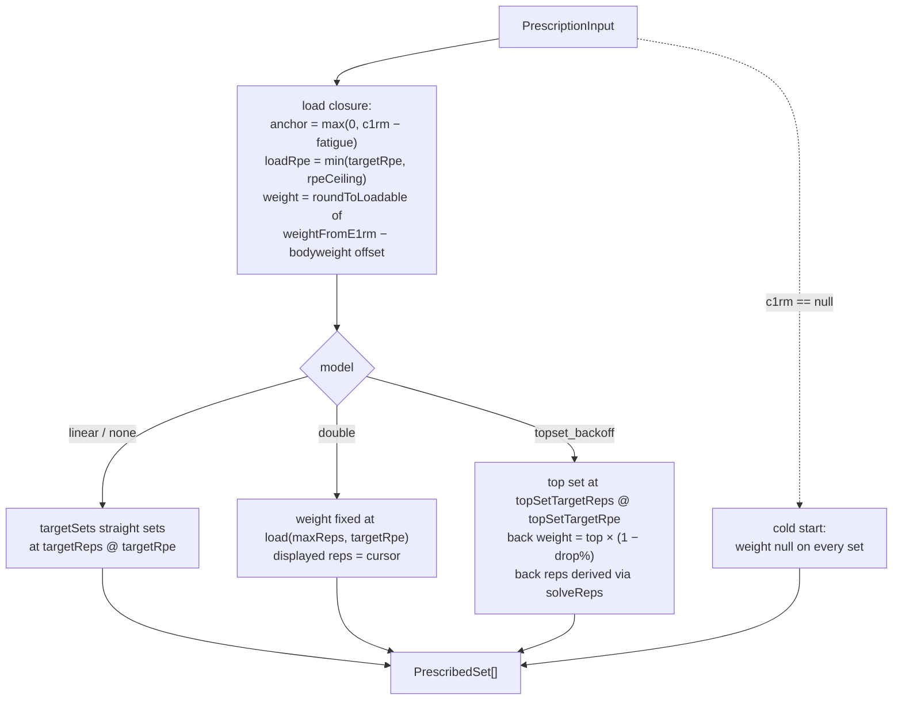

# Prescription Pipeline

How a routine becomes concrete sets with weights. The engine's design rule: **`src/engine/service.ts` is the only engine file that touches Dexie** — everything it orchestrates (`prescription.ts`, `mesocycle.ts`, `fatigue.ts`, `state.ts`, `matrix.ts`) is pure and injectable, so the whole pipeline is deterministic and replayable.

> User-facing overview: [README — Per-Session Prescription Pipeline](../../README.md)

## Three service entrypoints

| Entrypoint            | File                    | When                           | Side effects                                                                                         |
| --------------------- | ----------------------- | ------------------------------ | ---------------------------------------------------------------------------------------------------- |
| `previewWorkout`      | `src/engine/service.ts` | Preview sheet, before starting | **None** — pending resets simulated in memory only                                                   |
| `prescribeWorkout`    | `src/engine/service.ts` | Workout start                  | Consumes pending resets (persists the −10% drop, exactly once, in a `progressionStates` transaction) |
| `applyWorkoutResults` | `src/engine/service.ts` | After finishing                | Progression fold — owned by [[applying-results]]                                                     |

`prescribeWorkout` returns a **slot-aligned** array (`(ExercisePrescription | null)[]`, one entry per routine slot, null for unresolvable exercises). Consumers must never fold it into a per-exercise-id map — see [[concepts#Slot alignment|slot alignment]].

## Shared assembly

Both preview and prescribe run the same assembly per exercise slot:

Stage order matters: config resolution ([[plans-and-routines#Config resolution|plans-and-routines]]) → mesocycle shift ([[mesocycles]]) → reset consumption → session fatigue ([[fatigue-and-slots]]) → set rendering. Both entrypoints also fetch the current bodyweight once and pass each exercise's [[concepts#Bodyweight offset|bodyweight offset]] into rendering ([[bodyweight]]). The preview additionally packages display data — `ExercisePreview` with `originalC1rm`/`resetEffects` for the strike-through pending-reset display, regression streak `n/3`, the `MesocyclePosition`, and the bodyweight share (`bodyweightOffsetKg`, plus a `bodyweightMissing` hint when a factor is set but no bodyweight is logged).

## Reset consumption

Mechanics of _consuming_ a [[concepts#Two-phase reset|two-phase reset]] (arming lives in [[applying-results#Two-phase reset|applying-results]]): if `resetPending` is set, `consumeReset` (`src/engine/state.ts`) drops c1RM by `RESET_DROP` (currently 10%) via `applyReset` (`state.ts`), clears the streak and the flag, and is idempotent. `prescribeWorkout` persists this exactly once at workout start — **not** during preview, and never during evaluation. This two-phase timing is why a regression session shows no load change until the following workout, and why the preview shows the upcoming drop as struck-through `originalC1rm` → new anchor.

## Per-exercise prescription

`prescribeExercise(input)` (`src/engine/prescription.ts`) is pure and stateless — the service hands it the post-reset `effectiveC1rm`, the effective params, the resolved matrix, the RPE ceiling, and the fatigue reduction:

### Target judges, Ceiling caps

The load closure implements [[concepts#Target vs Ceiling|Target vs Ceiling]]: the RPE used for the _load calculation_ is `min(targetRpe, rpeCeiling)`, but the **displayed** target RPE stays `targetRpe` — only the weight is capped. Outcomes are later judged against the target, never the ceiling. The `none` model skips the cap entirely (it never prescribes above its own target).

### Bodyweight offset

For exercises with a `bodyweightFactor`, the anchor is a **total load**, so the load closure subtracts the [[concepts#Bodyweight offset|bodyweight offset]] _before_ rounding — the displayed added weight lands on the loadable grid and may be negative (assistance). Offset 0 is a strict identity. Full model: [[bodyweight]].

### Top set + back-off derivation

Back-off **weight** is recalculated from the top-set weight every session — the percentage drop applies to the **total** load (`(top + offset) × (1 − percentageDrop/100) − offset`, rounded loadable). Back-off **reps** are derived, not configured: the dropped %-of-1RM is fed to `solveReps` (`src/engine/calculator.ts`) with `e1rm = 1`, asking "at this fraction of 1RM, how many reps land on `backOffRpe`?" — a c1RM-independent search, so back-off reps render even at cold start. Each back-off set carries its `backoffFraction` so the tracker can fill weights once the top set is logged.

### Cold start

When `c1rm` is null ([[concepts#Cold start|cold start]]), every set renders with `weight: null` — free-entry rows. The first logged set then governs the rest of the session in the tracker ([[workout-tracking#Green dot represcription|workout-tracking]]), and the first qualifying session seeds the anchor ([[applying-results#History seeding and cold start|applying-results]]).

## Output types

- `PrescribedSet` (`src/engine/prescription.ts`): `{reps, rpe, weight, role: "straight" | "top" | "backoff", backoffFraction?}`.
- `ExercisePrescription` (`prescription.ts`): the slot's sets plus the **unreduced** post-reset `c1rm` and the applied `fatigueReduction` — evaluation needs both to reconstruct the baseline.
- `ExercisePreview` / `WorkoutPreview` / `MesocyclePosition` (`src/engine/service.ts`): preview display shapes.

All targets are clamped to sensible limits (sets ≥ 1, reps ≥ 1, RPE ≤ 10).

## Key functions

| Function                      | File                         | Note                                     |
| ----------------------------- | ---------------------------- | ---------------------------------------- |
| `previewWorkout`              | `src/engine/service.ts`      | Read-only; in-memory reset simulation    |
| `prescribeWorkout`            | `src/engine/service.ts`      | Slot-aligned; persists reset consumption |
| `prescribeExercise`           | `src/engine/prescription.ts` | Pure per-slot rendering                  |
| `buildSets` (internal)        | `src/engine/prescription.ts` | Per-model set shapes                     |
| `consumeReset` / `applyReset` | `src/engine/state.ts`        | −10%, idempotent, clears streak+flag     |
| `solveReps`                   | `src/engine/calculator.ts`   | Back-off rep derivation                  |
| `effectiveConfig` (internal)  | `src/engine/service.ts`      | normalize + meso shift                   |
| `rpeCeilingOf` (internal)     | `src/engine/service.ts`      | `none` caps at its own target            |
