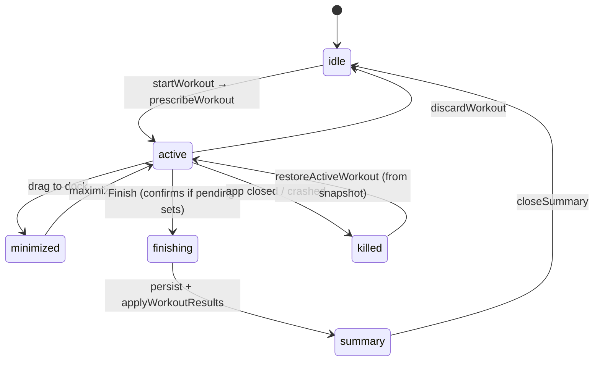

# Workout Tracking

The running-workout machinery: how a session starts, how sets are logged, how the [[concepts#Green dot|green dot]] re-prescribes mid-session, how the session survives an app kill, and the exact ordering when it finishes.

## Session state machine



## The two composables

Both are module-level singletons so every component shares one source of truth:

|              | `useActiveWorkout` (`src/composables/useActiveWorkout.ts:131`)                                                                                                    | `useWorkoutTracker` (`src/composables/useWorkoutTracker.ts:138`)                                                  |
| ------------ | ----------------------------------------------------------------------------------------------------------------------------------------------------------------- | ----------------------------------------------------------------------------------------------------------------- |
| Owns         | Session identity: the `Workout` record, routine, exercises map, slot-aligned prescriptions, planned counts, summary state, calculator sets, minimized/sheet flags | Editing state: per-exercise cards of `SetEntry` rows, completion, proposals, drag-reorder, snapshot writes        |
| Engine calls | `prescribeWorkout` (start), `applyWorkoutResults` (finish)                                                                                                        | `proposeSetAdjustment`, `roundToLoadable`                                                                         |
| Key exports  | `startWorkout` (`:132`), `finishWorkout` (`:230`), `restoreActiveWorkout` (`:98`), `discardWorkout`, `logCalculatorSet`                                           | `rebuildOrRestore` (`:161`), `completeSet`/`toggleSet` (`:291`), `proposalFor` (`:356`), `applyProposal` (`:419`) |

**Start**: `startWorkout(routineId?)` loads the routine + exercises, calls `prescribeWorkout` ([[prescription-pipeline]]) for slot-aligned prescriptions, creates an empty `Workout`, and opens the sheet. A prescription failure is swallowed — a workout can always start. The tracker then builds one card per slot, prefilling rows from `PrescribedSet`s.

**UI shell**: `WorkoutBottomSheet.vue` — a minimizable `AppBottomSheet` with live duration and a rest stopwatch that resets on each completed set, paging between `WorkoutTrackerPanel` and `WorkoutCalculatorPanel`. Set rows (`WorkoutSetRow.vue`) keep weights in kg internally and validate on complete.

## Green dot represcription

Mechanics home for [[concepts#Green dot|green dot]]. Three related behaviors, all built on `proposeSetAdjustment` (`src/engine/adjustment.ts:32`) — which derives a demonstrated e1RM from a completed set (`impliedE1rm`), re-renders a remaining set's weight for its target reps@RPE, and returns null when the change is within the ±2.5 kg `weightMatches` band (trivial deviations are noise) or the target has no RPE:

1. **Proposal surfacing** — `proposalFor` (`useWorkoutTracker.ts:356`): for a pending, prescription-backed set whose _immediately preceding_ completed set has valid reps/weight/RPE, compute a proposal. The set's index badge becomes a clickable green dot; `ReprescriptionPopover.vue` shows Load `old → new` and rep changes.
2. **Apply with cascade** — `applyProposal` (`useWorkoutTracker.ts:419`): user-confirmed; rewrites the set's `target` (so it becomes the new adherence baseline) and cascades through the remaining pending sets **of that card only** — back-off rows rescale off the re-prescribed top set and only ever adjust downward.
3. **Cold-start governor** — `fillColdStartFromGovernor` (`useWorkoutTracker.ts:315`): automatic (no confirm) — once the first set of a [[concepts#Cold start|cold-start]] exercise is logged, its demonstrated capacity fills the remaining empty rows (back-offs via their `backoffFraction`). Non-destructive and idempotent.

The guardrail: adjustments are **today-only** and never touch [[concepts#c1RM|c1RM]]. Post-session divergence correction is the [[concepts#Catch-up|catch-up]]'s job — keeping the two mechanisms decoupled means a bad in-session guess can't corrupt the anchor.

## Snapshot persistence

An in-progress workout survives app death via a localStorage snapshot (`src/composables/workoutPersistence.ts`): key `yafa:activeWorkout`, versioned (`SNAPSHOT_VERSION` currently 2 — bump it when the shape changes; stale versions are discarded, not migrated). The snapshot embeds everything needed to resume: workout, routine, exercises map, **slot-aligned** prescriptions, planned counts, calculator sets, cards, and UI state.

Write path: the tracker debounces `persist()` at 400 ms on any card change and flushes synchronously on `visibilitychange`/`pagehide`. Read path: `restoreActiveWorkout` (`useActiveWorkout.ts:98`) runs in `main.ts` _before_ the app mounts, rehydrates all refs, and hands the tracker its cards through a one-shot `takePendingRestore`. The snapshot is device-only — deliberately excluded from backups ([[backup-restore#What travels in a backup|backup-restore]]) — and cleared on finish/discard.

## Finish ordering

`finishWorkout` (`useActiveWorkout.ts:230`) runs a deliberate sequence:

```mermaid
sequenceDiagram
    participant UAW as useActiveWorkout
    participant AN as analytics
    participant DB as Dexie
    participant ENG as engine service

    UAW->>UAW: merge calculator sets, set endTime,<br/>drop untouched exercises
    UAW->>AN: buildWorkoutSummary (BEFORE persist)
    Note over UAW,AN: PR history must exclude this session;<br/>adherence must use pre-learning matrices
    UAW->>DB: db.workouts.add(completed)
    UAW->>ENG: applyWorkoutResults → CalibrationChange[]
    UAW->>UAW: reset() then show summary
```

Building the summary **before** persisting is a correctness invariant, not a style choice: `detectPrs` compares against history and must not see the current session, and adherence should be judged against the matrices as they were when the session was prescribed — `applyWorkoutResults` may rewrite them ([[applying-results#Ordering invariants|applying-results]]). Summary content itself: [[analytics#Workout summary, adherence and PRs|analytics]].

## Calculator panel

`WorkoutCalculatorPanel.vue` is a routine-agnostic tool inside the running workout: solve any of weight/reps/RPE from the other two (`solveWeight`/`solveReps`/`solveRpe`, `src/engine/calculator.ts:21/36/59` — same matrix as prescriptions, so results agree), a live effective e1RM (`liveEffectiveE1rm`, `src/engine/state.ts:212` — the mid-session mirror of the catch-up), and an optional fatigue toggle (`computeFatigueAdjustment`). Sets logged here are kept separate (`calculatorSets`) and merged into the workout only at finish.

## Key functions

| Function                          | Anchor                                           | Note                                |
| --------------------------------- | ------------------------------------------------ | ----------------------------------- |
| `startWorkout`                    | `src/composables/useActiveWorkout.ts:132`        | Load → prescribe → open sheet       |
| `finishWorkout`                   | `src/composables/useActiveWorkout.ts:230`        | Summary before persist before fold  |
| `restoreActiveWorkout`            | `src/composables/useActiveWorkout.ts:98`         | Pre-mount snapshot rehydration      |
| `proposeSetAdjustment`            | `src/engine/adjustment.ts:32`                    | Pure proposal; never touches c1RM   |
| `proposalFor`                     | `src/composables/useWorkoutTracker.ts:356`       | Green-dot surfacing rule            |
| `applyProposal`                   | `src/composables/useWorkoutTracker.ts:419`       | Confirmed apply + card-only cascade |
| `fillColdStartFromGovernor`       | `src/composables/useWorkoutTracker.ts:315`       | Auto cold-start fill                |
| `read/write/clearWorkoutSnapshot` | `src/composables/workoutPersistence.ts:39/55/66` | Versioned localStorage snapshot     |
| `liveEffectiveE1rm`               | `src/engine/state.ts:212`                        | Calculator's live anchor estimate   |
