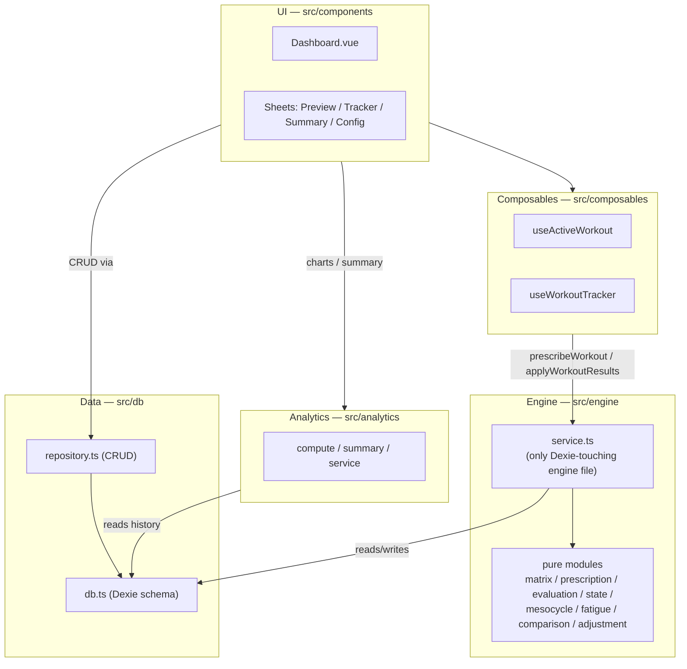

# YAFA Architecture — Map of Content

This doc set explains **how yafa-pwa works under the hood**: the data model, the planning surface, the workout engine, and everything that happens after a set is logged. It anchors every claim to code (function names, file paths, and — in per-doc "Key functions" tables — line numbers verified at the commit in each file's `source-commit` frontmatter).

**Boundary with the [README](../README.md):** the README owns the philosophy, feature narrative, and user-facing behavior. These docs own code anchoring, data flow, orderings, and invariants. Read the README first if you're new to the domain concepts; read [[concepts]] for the precise vocabulary.

## System at a glance

YAFA is an **offline-first PWA** (Vue 3 Composition API, TypeScript, Dexie/IndexedDB, Tailwind v4). All domain data lives in IndexedDB on the device; an in-progress workout is snapshotted to localStorage. The heart of the app is a **pure, Vue-free workout engine**: every prescribed weight derives from a per-exercise planning anchor ([[concepts#c1RM|c1RM]]) through an editable [[concepts#RPE matrix|RPE matrix]], and every finished session folds back into that anchor deterministically.

The dependency rule from CLAUDE.md: engine functions stay pure (everything injectable), all DB access goes through `repository.ts` or `service.ts`, composables hold Vue-specific logic only.

## The exercise lifecycle

One exercise's journey through a training session — each stage is owned by one doc:

```mermaid
flowchart LR
    NORM["normalizeProgressionParams"] --> MESO["applyMesoToParams"]
    MESO --> RESET["consumeReset<br/>(−10% if armed)"]
    RESET --> FAT["computeFatigueAdjustment"]
    FAT --> PRESC["prescribeExercise"]
    PRESC --> EXEC["UI execution<br/>(green-dot proposals)"]
    EXEC --> EVAL["evaluate<br/>(success / hold / regression)"]
    EVAL --> STEP["step + catchUpC1rm"]
    STEP --> LEARN["correctRpeMatrix<br/>(applied LAST)"]
    LEARN --> PERSIST["putProgressionState"]
```

| Stage                        | Function                                    | Owning doc                |
| ---------------------------- | ------------------------------------------- | ------------------------- |
| Config resolution & backfill | `normalizeProgressionParams`                | [[progression-models]]    |
| Periodization shift          | `applyMesoToParams`                         | [[mesocycles]]            |
| Reset consumption            | `consumeReset`                              | [[prescription-pipeline]] |
| Session fatigue              | `computeFatigueAdjustment`                  | [[fatigue-and-slots]]     |
| Prescription                 | `prescribeExercise`                         | [[prescription-pipeline]] |
| Execution & represcription   | `proposeSetAdjustment`, `useWorkoutTracker` | [[workout-tracking]]      |
| Outcome judgment             | `evaluate`                                  | [[applying-results]]      |
| State transition & catch-up  | `step`, `catchUpC1rm`                       | [[applying-results]]      |
| Matrix learning              | `correctRpeMatrix`                          | [[rpe-matrix]]            |
| Post-hoc analysis            | `computeWorkoutSummary`, `buildChartSeries` | [[analytics]]             |

The best single code reference for the full wiring is the integration harness `src/engine/__tests__/loop.spec.ts`, which mirrors prescribe → evaluate → step → catch-up → matrix correction without Dexie.

## Reading paths

**Foundations**

1. [[concepts]] — the vocabulary (c1RM, qualifying set, two-phase reset, …)
2. [[data-model]] — Dexie schema, entities, repository invariants
3. [[backup-restore]] — export/import and the raw-workout recovery fallback

**Planning** — what the user configures

1. [[plans-and-routines]] — Plan → Routine → exercise slot hierarchy and config resolution
2. [[progression-models]] — the four models and their parameters
3. [[mesocycles]] — periodization: week focus → additive target shifts
4. [[rpe-matrix]] — the weight-math foundation and its two editing paths

**Execution** — what happens when you train

1. [[prescription-pipeline]] — preview vs. prescribe, per-model set building
2. [[fatigue-and-slots]] — same-session fatigue and the slot-alignment invariant
3. [[workout-tracking]] — the running workout: tracker, green dot, snapshots

**Evaluation** — what happens after you train

1. [[applying-results]] — the fold: outcomes, resets, catch-up (the centerpiece doc)
2. [[analytics]] — charts, adherence, PRs, CSV export

## UI surface map

The only place this doc set enumerates UI components — topical docs reference them from here.

| Component                                                                                 | Purpose                                                      | Owning doc                |
| ----------------------------------------------------------------------------------------- | ------------------------------------------------------------ | ------------------------- |
| `Dashboard.vue`                                                                           | Home hub: start workout, active-plan routines, quick nav     | [[workout-tracking]]      |
| `PlansPage.vue` / `PlanDetailsPage.vue`                                                   | Browse/activate plans, mesocycle entry point                 | [[plans-and-routines]]    |
| `RoutineDetailsPage.vue`                                                                  | Exercise slots, drag-reorder (load-bearing), config entry    | [[plans-and-routines]]    |
| `ExerciseConfigSheet.vue`                                                                 | Progression model picker, params, locks, fatigue config      | [[progression-models]]    |
| `MesocycleSheet.vue` / `MesocycleChart.vue`                                               | Week-by-week focus allocation, presets                       | [[mesocycles]]            |
| `ExerciseRpeMatrixEditor.vue` / `RpeMatrixTable.vue`                                      | Per-exercise matrix override editing                         | [[rpe-matrix]]            |
| `WorkoutPreviewSheet.vue`                                                                 | Read-only prescription preview, pending-reset display        | [[prescription-pipeline]] |
| `WorkoutBottomSheet.vue`                                                                  | Minimizable running-workout shell (Tracker/Calculator pager) | [[workout-tracking]]      |
| `WorkoutTrackerPanel.vue` / `WorkoutTrackerCard.vue` / `WorkoutSetRow.vue`                | Set logging rows, green-dot badges                           | [[workout-tracking]]      |
| `ReprescriptionPopover.vue`                                                               | Green-dot proposal UI                                        | [[workout-tracking]]      |
| `WorkoutCalculatorPanel.vue`                                                              | Solve-for-the-third calculator, live effective e1RM          | [[workout-tracking]]      |
| `summary/WorkoutSummarySheet.vue` (+ `SummaryHero`, `PrHighlights`, `CalibrationSummary`) | Post-workout summary                                         | [[analytics]]             |
| `AnalyticsPage.vue` / `AnalyticsChart.vue` / `AnalyticsChartCard.vue`                     | Configurable charts, CSV export                              | [[analytics]]             |
| `MeasurementsPage.vue`                                                                    | Body measurement tracking                                    | [[data-model]]            |
| `ImportExportSheet.vue`                                                                   | Backup export/import with merge preview                      | [[backup-restore]]        |
| `SettingsPage.vue`                                                                        | Theme, units, global matrix display, danger zone             | [[rpe-matrix]]            |
| `AppBottomSheet.vue` / `ConfirmDialog.vue` / `NumericKeypad.vue`                          | Shared primitives (drag-dismiss sheet, confirms, keypad)     | —                         |

Routes live in `src/router/index.ts`: `/` dashboard, `/plans(/:id)`, `/routines/:id`, `/exercises(/:id)`, `/analytics`, `/measurements`, `/history`, `/settings`, `/install`.

## Maintenance

- **Anchors:** prose references use symbol + path only. Exact `path:line` anchors appear solely in each doc's "Key functions" table and are valid at that doc's `source-commit`. When updating a doc: re-verify with `grep -n "<symbol>" <path>`, fix lines, bump `source-commit` and `updated`.
- **Constants:** always cited by name with the current value in parentheses ("`CATCHUP_THRESHOLD` (currently 10%)") so a tuning change doesn't silently falsify prose. All tuning values live in `src/engine/constants.ts`.
- **Internal functions** (not exported, e.g. `buildSets`, `foldQualifiedSession`) are marked "(internal)" — they rot faster, so their descriptions stay behavioral.
- **Verification:** wikilink targets must match a filename or alias; Mermaid blocks use only Obsidian-bundled diagram types (`flowchart`, `sequenceDiagram`, `stateDiagram-v2`, `erDiagram`, `classDiagram`).
