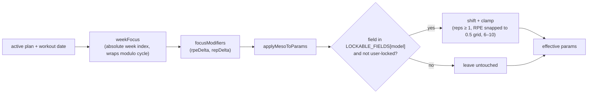

# Mesocycles & Periodization

A plan can carry a **mesocycle**: an ordered list of weeks, each with a [[concepts#Mesocycle focus|training focus]]. The core design decision: a week's focus produces **additive shifts to RPE and rep targets** — never a direct load multiplier — and the prescribed load then re-renders from the shifted targets through the [[concepts#RPE matrix|RPE matrix]]. Deload weeks are just weeks whose focus eases those targets.

> User-facing overview: [README — Periodization & Mesocycles](../../README.md)

## Model

- `Plan.mesocycle?: MesocycleWeek[]` (`src/db/types.ts:131/127`) — absent means no periodization. Weeks are objects (`{focus}`) so per-week tuning can be added later without a migration.
- `PeriodizationFocus` (`src/db/types.ts:121`): `hypertrophy` | `strength` | `peaking` | `deload`.
- Display metadata (`FOCUS_META` with color vars and viz-only intensity/volume hints), canonical ordering (`FOCUS_ORDER`), and presets (`MESOCYCLE_PRESETS`: "Classic 6-week peak", "4-week accumulation") live in `src/config/periodization.ts:27/78/89`.

## Focus deltas

The shift constants live in `src/engine/constants.ts` (not in the UI):

| Focus       | `MESO_RPE_DELTA` (`src/engine/constants.ts:94`) | `MESO_REP_DELTA` (`src/engine/constants.ts:102`) | Net effect                                     |
| ----------- | ----------------------------------------------- | ------------------------------------------------ | ---------------------------------------------- |
| hypertrophy | 0                                               | +1                                               | Slightly more reps at the same effort          |
| strength    | +0.5                                            | −2                                               | Heavier: fewer reps, higher target RPE         |
| peaking     | +1                                              | −3                                               | Heaviest: lowest reps, highest RPE             |
| deload      | −1.5                                            | 0                                                | Same reps at much lower effort → lighter loads |

**Set counts (volume) are never periodized** — only reps and RPE shift; working-set counts stay as configured. Double progression's rep _range_ is also untouched (the engine owns it via the cursor).

## Application pipeline

- `weekFocus(mesocycle, weekIndex)` (`src/engine/mesocycle.ts:45`) wraps modulo the cycle length (negative-safe), so a 6-week mesocycle repeats indefinitely. The week index is absolute: `floor((now − plan.created_at) / WEEK_MS)` (`absoluteWeekIndex` (internal), `src/engine/service.ts:119`).
- `focusModifiers(focus)` (`src/engine/mesocycle.ts:34`) reads the delta tables into a `MesoModifiers {rpeDelta, repDelta}`.
- `applyMesoToParams(model, params, mods, lockedFields)` (`src/engine/mesocycle.ts:79`) returns a **new** params object. Per model: linear/none shift `targetReps` + `targetRpe`; double shifts only `targetRpe`; topset shifts `topSetTargetReps` + `topSetTargetRpe` (`backOffRpe` stays put, but derived back-off reps still move because the top set's %-of-1RM moves). Every shifted field is gated by [[concepts#lockedFields|lockedFields]] — see [[progression-models#Lockable fields|progression-models]] for the per-model lockable sets.
- The shifted `targetRpe` becomes the _effective_ target used both for the load and for the ceiling comparison downstream ([[prescription-pipeline#Target judges, Ceiling caps|prescription-pipeline]]).

## Where it hooks in

Both engine entrypoints resolve the owning plan (active plan wins), derive the week's modifiers as of the workout date, and apply them inside `effectiveConfig` (internal, `src/engine/service.ts:171`) right after normalization — so preview, prescription, and post-session re-rendering all see the same shifted targets. `applyWorkoutResults` re-derives the modifiers **as of the session's `startTime`**, not "now", so late evaluation can't judge a session against the wrong week. The preview surfaces a `MesocyclePosition` (`src/engine/service.ts:79`) — week index, cycle length, focus — for display.

Analytics can also bucket charts by mesocycle ([[analytics#Chart pipeline|analytics]]).

## UI

- **`MesocycleSheet.vue`** — the visual week planner: add/remove/drag-reorder weeks, per-week 4-button focus selector (colored via `FOCUS_META`), preset buttons, and a live `MesocycleChart.vue` preview. It edits a deep clone and emits `save(weeks)`; `PlanDetailsPage.vue` persists via `setPlanMesocycle`. The sheet only allocates focuses — the deltas above are engine constants.
- **`ExerciseConfigSheet.vue`** shows lock toggles and a periodization hint banner only when the routine is actually periodized (`periodizationEnabled`, see [[plans-and-routines#Invariants|plans-and-routines]]).
- **`WorkoutPreviewSheet.vue`** shows the current week's focus and modifier arrows before starting a session.

## Key functions

| Function                            | Anchor                           | Note                           |
| ----------------------------------- | -------------------------------- | ------------------------------ |
| `focusModifiers`                    | `src/engine/mesocycle.ts:34`     | Focus → `{rpeDelta, repDelta}` |
| `weekFocus`                         | `src/engine/mesocycle.ts:45`     | Cycle wrap, negative-safe      |
| `applyMesoToParams`                 | `src/engine/mesocycle.ts:79`     | Lock-aware additive shift      |
| `MESO_RPE_DELTA` / `MESO_REP_DELTA` | `src/engine/constants.ts:94/102` | The delta tables               |
| `LOCKABLE_FIELDS`                   | `src/config/periodization.ts:70` | What a lock protects           |
| `MESOCYCLE_PRESETS`                 | `src/config/periodization.ts:89` | Sheet presets                  |
| `mesocyclePosition` (internal)      | `src/engine/service.ts:131`      | Preview's week/focus display   |
