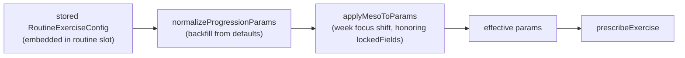

# Plans & Routines

The planning hierarchy is **Plan → Routine → exercise slot → progression config**. A `Plan` owns an ordered list of routine ids and (optionally) a mesocycle; a `Routine` owns an ordered list of exercise slots; each slot optionally embeds a `RoutineExerciseConfig` — the progression contract the engine reads. Entity shapes and referential-integrity cascades are covered in [[data-model]]; this doc covers how a stored config becomes the _effective_ config, and which planning-UI details are load-bearing.

## Config resolution

Where the numbers a prescription uses actually come from:

1. **Stored config** — `RoutineExerciseConfig` (`src/db/types.ts`): `progressionModel`, `progressionParams`, `lockedFields?`. Configs are embedded in the routine document, so old records may lack newer fields.
2. **Normalization** — `normalizeProgressionParams` (`src/config/progression.ts`) merges `DEFAULT_PROGRESSION_PARAMS` with the saved params at **every read boundary** (config sheet, preview, engine service). Details in [[progression-models#Defaults and normalization|progression-models]].
3. **Periodization** — `applyMesoToParams` shifts RPE/rep targets per the active week's [[concepts#Mesocycle focus|focus]], skipping [[concepts#lockedFields|locked fields]]. Details in [[mesocycles]].
4. The result feeds the [[prescription-pipeline]].

⚠️ `RoutineExerciseConfig` also declares loose top-level mirror fields (`targetSets`, `minReps`, …). These are **vestigial** — seed data populates some, but the engine reads only `progressionParams`.

## Exercise order is load-bearing

The drag-to-reorder in `RoutineDetailsPage.vue` (via `useSortableList`, persisted by `persistExercises`) doesn't just change display order: **slot order defines the fatigue priors**. `priorsBySlot` (`src/engine/service.ts`) walks the routine in order so each slot sees the muscle profiles of every earlier slot — moving an exercise up or down changes the loads of exercises after it. See [[fatigue-and-slots#Slot priors|fatigue-and-slots]].

Duplicate slots of the same exercise are allowed and are treated as distinct slots throughout ([[concepts#Slot alignment|slot alignment]]) — a repeated exercise even counts as its own fatigue prior.

## Invariants

- **Single active plan** — activating a plan deactivates all others (`setPlanActive`, transaction-guarded; see [[data-model#Repository layer|data-model]]).
- **Cascade integrity** — deleting plans/routines/exercises never leaves dangling references ([[data-model#Repository layer|data-model]]).
- **Periodization is plan-scoped** — a routine is only periodized when _some plan containing it_ has a non-empty mesocycle. `RoutineDetailsPage.vue` computes `periodizationEnabled` exactly this way and passes it down to gate the lock toggles.
- **Mesocycle edits are isolated** — `MesocycleSheet` edits a deep clone and persists via `setPlanMesocycle`, separate from plan name/description updates.

## Planning UI

(Full component map: [[index#UI surface map|index]].)

- **`PlanDetailsPage.vue`** — plan hub: activate (`setPlanActive`), edit, delete, create routines into the plan (`createRoutine(input, planId)`), open `MesocycleSheet`, and render the focus breakdown ("2 Hypertrophy · 2 Strength · …").
- **`RoutineDetailsPage.vue`** — slot list with drag-reorder, add/edit/remove exercises, and the entry point to per-slot config.
- **`ExerciseConfigSheet.vue`** — the config editor: segmented progression-model picker (switching models resets params to that model's defaults and clears locks), per-model fields, an Advanced section (target RPE, RPE ceiling, increment, fatigue reduction — the latter two via `WeightIncrementField.vue`, which handles the kg-vs-percent duality of `WeightIncrementUnit`), `LockToggle.vue` beside each lockable field (only when `periodizationEnabled`), the exercise's global notes, and the embedded matrix editor. Field semantics live in [[progression-models]]; the matrix editor in [[rpe-matrix#Manual editing|rpe-matrix]].
- Config saves replace the slot's embedded config; exercise notes save separately (`updateExerciseNotes`) since they belong to the `Exercise`, not the slot.
- **`SaveAsRoutineSheet.vue`** — reached from `WorkoutSummarySheet.vue` after an ad-hoc **empty** workout (`canSaveAsRoutine` in `useActiveWorkout`). It maps the finished session's exercises to slots via `workoutToRoutineExercises` (`src/utils/progression.ts`) — one ordered slot per exercise, each on the `"none"` progression model with `targetSets`/`targetReps` seeded from what was logged — and persists into an existing plan (`createRoutine`) or a brand-new one (`createRoutineInNewPlan`).

## Key functions

| Function                                           | File                                    | Note                                                                    |
| -------------------------------------------------- | --------------------------------------- | ----------------------------------------------------------------------- |
| `normalizeProgressionParams`                       | `src/config/progression.ts`             | Read-time backfill — see [[progression-models]]                         |
| `priorsBySlot`                                     | `src/engine/service.ts`                 | Routine order → fatigue priors                                          |
| `setPlanActive`                                    | `src/db/repository.ts`                  | Single-active invariant                                                 |
| `setPlanMesocycle`                                 | `src/db/repository.ts`                  | Persists periodization weeks                                            |
| `createRoutine`                                    | `src/db/repository.ts`                  | Optionally appends to a plan's `routineIds`; accepts embedded exercises |
| `createRoutineInNewPlan`                           | `src/db/repository.ts`                  | Creates a plan + routine atomically (save-as-routine)                   |
| `workoutToRoutineExercises`                        | `src/utils/progression.ts`              | Finished workout → `"none"`-model routine slots                         |
| `handleSaveConfig` / `persistExercises` (internal) | `src/components/RoutineDetailsPage.vue` | Slot insert/replace + ordered persistence                               |
