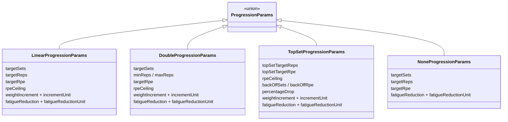

# Progression Models

Each exercise slot is assigned one of four progression models that dictates how its sets are built at prescription time and how its [[concepts#c1RM|c1RM]] adapts afterwards. The models' _narrative_ descriptions live in the [README](../../README.md); this doc covers the parameter shapes, defaults, and exactly which function implements which rule.

## Model taxonomy

The `ProgressionParams` union, its four members, and `ProgressionModelType` all live in `src/db/types.ts`.

Two RPE knobs with distinct jobs ([[concepts#Target vs Ceiling|Target vs Ceiling]]): `targetRpe` is what the load aims for _and_ what outcomes are judged against; `rpeCeiling` only caps the load calculation. `none` has no `rpeCeiling` — it never prescribes above its own target. `weightIncrement` is what's added to c1RM on success (flat kg, or percent of current c1RM — percent gains compound), **never a direct load delta**. The fatigue fields cap the same-session reduction ([[fatigue-and-slots]]).

## Defaults and normalization

`DEFAULT_PROGRESSION_PARAMS` (`src/config/progression.ts`) is the single source of per-model defaults (linear 3×5 @ RPE 8, ceiling 9, +2.5 kg; double 3 sets × 6–10 @ 8; top set 3 reps @ 8 with 3 back-offs @ 7 at −10%; none 3×8 @ 8; all with 10% fatigue reduction).

`normalizeProgressionParams(model, saved?)` (`src/config/progression.ts`) merges defaults with the saved config — saved non-`undefined` values win, explicit `undefined` never clobbers a default. Because configs are **embedded** in routine documents, required fields added later (`targetRpe`, `rpeCeiling`, `incrementUnit`, fatigue fields) are backfilled at _every read boundary_: the config sheet on load, the preview, and the engine service. The v10 schema migration stamped the fatigue fields onto stored records as the structural counterpart ([[data-model#Stores and schema versions|data-model]]).

## Per-model behavior matrix

Cross-referencing what each model does at each pipeline stage — mechanics live in the linked docs:

| Model            | Set shape at prescription (`buildSets` (internal), `src/engine/prescription.ts`)                                                                                                                                                            | Success / regression rule (`evaluate`, `src/engine/evaluation.ts`)                                                                                        | On success (`applyIncrement`, `src/engine/state.ts`) | Extra state                                                                                                |
| ---------------- | ------------------------------------------------------------------------------------------------------------------------------------------------------------------------------------------------------------------------------------------- | --------------------------------------------------------------------------------------------------------------------------------------------------------- | ---------------------------------------------------- | ---------------------------------------------------------------------------------------------------------- |
| `linear`         | `targetSets` straight sets at (targetReps, targetRpe)                                                                                                                                                                                       | Success: **every** set ≥ targetReps at ≤ targetRpe at prescribed weight. Regression: worst set grinding (≤ targetReps at prescribed weight, RPE > target) | c1RM += increment                                    | —                                                                                                          |
| `double`         | Weight fixed at `load(maxReps, targetRpe)` so it holds constant across the rep cycle; displayed reps = cursor                                                                                                                               | Success: every set reaches maxReps, worst RPE ≤ target. Regression: worst set bottomed at ≤ minReps while grinding (`rpe + 1 > targetRpe`)                | c1RM += increment; cursor back to minReps            | `doubleRepCursor` walks minReps → maxReps on holds                                                         |
| `topset_backoff` | 1 top set + `backOffSets` back-offs at `topWeight × (1 − percentageDrop/100)`; **back-off reps are derived, not configured** — `solveReps` (`src/engine/calculator.ts`) finds the rep count landing on `backOffRpe` at the dropped %-of-1RM | Only the **top set** judges: success = reps ≥ target at RPE ≤ target (no weight clause); regression = top set grinding at prescribed weight               | c1RM += increment                                    | Back-offs never drive progression but still feed the [[concepts#RPE matrix correction\|matrix correction]] |
| `none`           | Straight sets at target; no ceiling cap                                                                                                                                                                                                     | Always **hold** — no auto-progression                                                                                                                     | —                                                    | —                                                                                                          |

Cross-cutting evaluation rules (worst-set decides, missing RPE → hold) are owned by [[applying-results#Evaluation semantics|applying-results]]. Set building details by [[prescription-pipeline#Per-exercise prescription|prescription-pipeline]].

## Lockable fields

`LOCKABLE_FIELDS` (`src/config/periodization.ts`) defines, per model, exactly which params periodization may touch — and therefore which get a `LockToggle` in the config sheet:

| Model             | Lockable (= periodizable)                                                |
| ----------------- | ------------------------------------------------------------------------ |
| `linear` / `none` | `targetSets`, `targetReps`, `targetRpe`                                  |
| `double`          | `targetSets`, `targetRpe` (the rep range is engine-owned via the cursor) |
| `topset_backoff`  | `topSetTargetReps`, `topSetTargetRpe`                                    |

`rpeCeiling` and the increment fields are deliberately **never lockable** — they're guardrails and progression tuning, not periodized targets. This file is shared by the UI and the engine so they can't disagree about what a lock protects. How locks are honored: [[mesocycles#Application pipeline|mesocycles]].

## Tuning constants

All in `src/engine/constants.ts`, cited by name: `DEFAULT_TARGET_RPE` (8), `DEFAULT_RPE_CEILING` (9). The outcome/reset numbers (`REGRESSION_RESET_TRIGGER`, `RESET_DROP`, `PRESCRIBED_WEIGHT_TOLERANCE_KG`) are documented with their mechanics in [[applying-results]].

## Key functions

| Function                     | File                          | Note                                         |
| ---------------------------- | ----------------------------- | -------------------------------------------- |
| `normalizeProgressionParams` | `src/config/progression.ts`   | Read-time backfill                           |
| `DEFAULT_PROGRESSION_PARAMS` | `src/config/progression.ts`   | Single source of defaults                    |
| `buildSets` (internal)       | `src/engine/prescription.ts`  | Per-model set shapes                         |
| `evaluate`                   | `src/engine/evaluation.ts`    | Per-model outcome dispatch (`:86/:120/:155`) |
| `applyIncrement`             | `src/engine/state.ts`         | kg-flat vs. compounding percent              |
| `advanceDoubleCursor`        | `src/engine/state.ts`         | Double's rep cursor                          |
| `LOCKABLE_FIELDS`            | `src/config/periodization.ts` | Lock/periodization contract                  |
