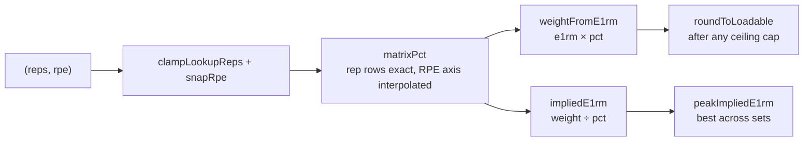
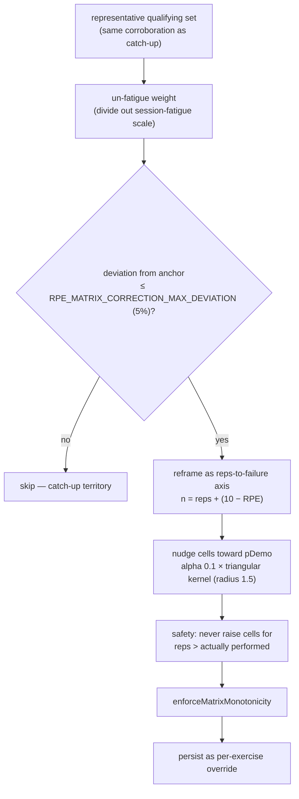

# RPE Matrix & e1RM Math

All weight math in YAFA flows through `src/engine/matrix.ts`. The [[concepts#RPE matrix|RPE matrix]] maps `(reps, RPE)` to a percentage of 1RM; prescriptions multiply it by [[concepts#c1RM|c1RM]], and analytics divide by it to get [[concepts#Implied e1RM|implied e1RMs]]. This doc is the mechanics home for the matrix in _all_ phases — lookup, qualifying sets, manual editing, and the adaptive correction.

> User-facing overview: [README — Cell-Based RPE Matrix](../../README.md)

Two invariants stated in the module itself:

1. **c1RM is kept unrounded** — only the rendered prescribed weight snaps to [[concepts#Loadable increment|loadable increments]].
2. The analytics-side `impliedE1rm` **never feeds prescription** (which always renders from c1RM).

## Structure and inheritance

`RpeMatrix = Record<reps, Record<rpe, pct>>` (`src/db/types.ts:82`), decimals 0–1. Grid bounds from `src/engine/constants.ts`: reps `MATRIX_MIN_REPS`–`MATRIX_MAX_REPS` (1–15), RPE `MATRIX_MIN_RPE`–`MATRIX_MAX_RPE` (6–10) in `RPE_STEP` (0.5) steps.

Hierarchical cascade: the global default `DEFAULT_RPE_MATRIX` (`src/db/rpeMatrix.ts`, seeded from RTS-style evidence-based values) applies to every exercise unless it stores its own `Exercise.rpeMatrix` override. Overrides materialize two ways: the user toggles "Overwrite RPE matrix" and edits cells, or the adaptive correction writes one automatically after a qualifying session.

## Lookup and derivation

`matrixPct(matrix, reps, rpe)` (`src/engine/matrix.ts:61`) is the key lookup, with a deliberate asymmetry:

- **Rep rows are looked up exactly** (integers, nearest present row if missing) — rows are user-editable, so inventing values between rows would be wrong.
- **Interpolation happens only on the RPE axis**: the RPE is clamped to the row's own min/max columns (never extrapolated past the grid), exact hits return directly, and off-grid values interpolate linearly between the two bracketing columns.

Derivations: `weightFromE1rm` (`matrix.ts:122`) returns the raw unrounded weight — the caller rounds via `roundToLoadable` (`matrix.ts:132`, `LOADABLE_INCREMENT_KG` currently 0.1 kg) **after** any RPE-ceiling cap. The inverse, `impliedE1rm` (`matrix.ts:106`), is `weight ÷ pct`; `peakImpliedE1rm` (`matrix.ts:186`) takes the best implied e1RM across a set list (peak, not mean).

## Qualifying sets

Mechanics home for [[concepts#Qualifying set|qualifying set]]: `isQualifyingSet` (`src/engine/matrix.ts:147`) gates which logged sets are honest enough to inform calibration — `actualRpe ≥ QUALIFYING_MIN_RPE` (8), reps within 1–`QUALIFYING_MAX_REPS` (10), positive weight. Low-RPE or very-high-rep sets carry too much estimation noise, so they never seed c1RM, never produce [[concepts#Demonstrated e1RM|demonstrated e1RMs]], and never count toward e1RM PRs. A relaxed gate (any real RPE, no rep ceiling) exists only as a cold-start seeding fallback.

## Manual editing

The editor path (`ExerciseRpeMatrixEditor.vue` + `RpeMatrixTable.vue`, embedded in the exercise form and config sheet) is **deliberately conservative**: `setMatrixCell` (`src/engine/matrix.ts:244`) applies the user's exact value, propagates the delta through a smoothing kernel over reps-to-failure space, then re-enforces monotonicity while **pinning the edited cell** — a hand edit never silently reshapes the whole grid. `enforceMatrixMonotonicity` (`matrix.ts:275`) iteratively clamps so percentages rise with RPE and fall with reps. Reset-to-default restores `DEFAULT_RPE_MATRIX` behind a confirm; persistence writes the override directly to the exercise record. The settings page displays the global matrix read-only.

## Adaptive correction

Within the ±10% band where a session broadly _agrees_ with the anchor, the engine refines the **shape** of the exercise's curve instead of moving c1RM (that's the [[concepts#Catch-up|catch-up]]'s job):

`correctRpeMatrix(matrix, completedSet, anchorE1rm, …)` (`src/engine/matrix.ts:353`) implements the learning: the demonstrated fraction `pDemo = min(1, weight / anchor)` pulls each cell by `alpha × kernelWeight × (pDemo − pOld)`, where the triangular kernel fades linearly within `RPE_MATRIX_CORRECTION_RADIUS` (1.5) in n-space — cells representing the same effort learn together. The anchor is the stable rules-driven c1RM (pre-catch-up).

**When** it runs — last in the [[concepts#Fold|fold]], so it only shapes future sessions — and its gating by `learnedRpeMatrix` (internal) are owned by [[applying-results#Ordering invariants|applying-results]].

## Consumers

- [[prescription-pipeline]] — every prescribed weight (`weightFromE1rm` + `roundToLoadable`).
- [[workout-tracking]] — green-dot proposals (`impliedE1rm` → re-render) and the calculator solvers (`solveWeight/solveReps/solveRpe` in `src/engine/calculator.ts` reuse `matrixPct`, so calculated loads match engine-prescribed ones; `solveReps` also derives top-set back-off reps).
- [[applying-results]] — demonstrated e1RMs for catch-up.
- [[analytics]] — e1RM charts and PR detection.

## Key functions

| Function                                 | Anchor                              | Note                                   |
| ---------------------------------------- | ----------------------------------- | -------------------------------------- |
| `matrixPct`                              | `src/engine/matrix.ts:61`           | Exact rep rows, RPE-axis interpolation |
| `impliedE1rm`                            | `src/engine/matrix.ts:106`          | Analytics inverse                      |
| `weightFromE1rm`                         | `src/engine/matrix.ts:122`          | Raw weight; round after ceiling cap    |
| `roundToLoadable`                        | `src/engine/matrix.ts:132`          | 0.1 kg snapping                        |
| `isQualifyingSet`                        | `src/engine/matrix.ts:147`          | Honesty gate                           |
| `peakImpliedE1rm`                        | `src/engine/matrix.ts:186`          | Best-set e1RM                          |
| `setMatrixCell`                          | `src/engine/matrix.ts:244`          | Manual edit, pinned cell               |
| `enforceMatrixMonotonicity`              | `src/engine/matrix.ts:275`          | ≤20-pass clamp                         |
| `correctRpeMatrix`                       | `src/engine/matrix.ts:353`          | Adaptive learning                      |
| `snapRpe` / `clampLookupReps`            | `src/engine/matrix.ts:32/40`        | Grid normalization                     |
| `solveWeight` / `solveReps` / `solveRpe` | `src/engine/calculator.ts:21/36/59` | Calculator solvers on the same matrix  |
