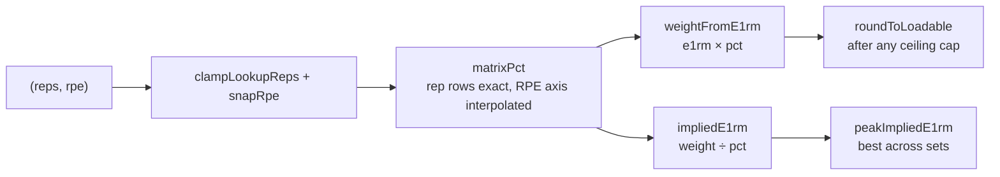

# RPE Matrix & e1RM Math

All weight math in YAFA flows through `src/engine/matrix.ts`. The [[concepts#RPE matrix|RPE matrix]] maps `(reps, RPE)` to a percentage of 1RM; prescriptions multiply it by [[concepts#c1RM|c1RM]], and analytics divide by it to get [[concepts#Implied e1RM|implied e1RMs]]. This doc is the mechanics home for the matrix in _all_ phases — lookup, qualifying sets, and manual editing. The matrix is **static data**: nothing in the engine rewrites it, so the only thing that ever changes a cell is a hand edit.

> User-facing overview: [README — Cell-Based RPE Matrix](../../README.md)

Two invariants stated in the module itself:

1. **c1RM is kept unrounded** — only the rendered prescribed weight snaps to [[concepts#Loadable increment|loadable increments]].
2. The analytics-side `impliedE1rm` **never feeds prescription** (which always renders from c1RM).
3. **The 1RM space is the total load** — stored sets carry the _added_ weight; callers lift bodyweight-factor exercises into total-load space before any matrix math, including the `isQualifyingSet` gate ([[bodyweight]]).

## Structure and inheritance

`RpeMatrix = Record<reps, Record<rpe, pct>>` (`src/db/types.ts`), decimals 0–1. Grid bounds from `src/engine/constants.ts`: reps `MATRIX_MIN_REPS`–`MATRIX_MAX_REPS` (1–15), RPE `MATRIX_MIN_RPE`–`MATRIX_MAX_RPE` (6–10) in `RPE_STEP` (0.5) steps.

Hierarchical cascade: the global default `DEFAULT_RPE_MATRIX` (`src/db/rpeMatrix.ts`, seeded from RTS-style evidence-based values) applies to every exercise unless it stores its own `Exercise.rpeMatrix` override. An override materializes exactly one way: the user toggles "Overwrite RPE matrix" and edits cells. (An earlier build also had the engine learn the curve automatically after a session; that was removed, and the override field is what a future implementation would write to.)

## Lookup and derivation

```mermaid
flowchart LR
    IN["(reps, rpe)"] --> CLAMP["clampLookupReps + snapRpe"]
    CLAMP --> PCT["matrixPct<br/>rep rows exact, RPE axis interpolated"]
    PCT --> W["weightFromE1rm<br/>e1rm × pct"]
    W --> ROUND["roundToLoadable<br/>after any ceiling cap"]
    PCT --> INV["impliedE1rm<br/>weight ÷ pct"]
    INV --> PEAK["peakImpliedE1rm<br/>best across sets"]
```

`matrixPct(matrix, reps, rpe)` (`src/engine/matrix.ts`) is the key lookup, with a deliberate asymmetry:

- **Rep rows are looked up exactly** (integers, nearest present row if missing) — rows are user-editable, so inventing values between rows would be wrong.
- **Interpolation happens only on the RPE axis**: the RPE is clamped to the row's own min/max columns (never extrapolated past the grid), exact hits return directly, and off-grid values interpolate linearly between the two bracketing columns.

Derivations: `weightFromE1rm` (`matrix.ts`) returns the raw unrounded weight — the caller rounds via `roundToLoadable` (`matrix.ts`, `LOADABLE_INCREMENT_KG` currently 0.1 kg) **after** any RPE-ceiling cap. The inverse, `impliedE1rm` (`matrix.ts`), is `weight ÷ pct`; `peakImpliedE1rm` (`matrix.ts`) takes the best implied e1RM across a set list (peak, not mean).

## Qualifying sets

Mechanics home for [[concepts#Qualifying set|qualifying set]]: `isQualifyingSet` (`src/engine/matrix.ts`) gates which logged sets are honest enough to inform calibration — `actualRpe ≥ QUALIFYING_MIN_RPE` (8), reps within 1–`QUALIFYING_MAX_REPS` (10), positive weight. Low-RPE or very-high-rep sets carry too much estimation noise, so they never seed c1RM, never produce [[concepts#Demonstrated e1RM|demonstrated e1RMs]], and never count toward e1RM PRs. A relaxed gate (any real RPE, no rep ceiling) exists only as a cold-start seeding fallback.

## Manual editing

The editor path (`ExerciseRpeMatrixEditor.vue` + `RpeMatrixTable.vue`, embedded in the exercise form and config sheet) is **deliberately conservative**: `setMatrixCell` (`src/engine/matrix.ts`) applies the user's exact value, propagates the delta through a smoothing kernel over reps-to-failure space (radius `MATRIX_EDIT_SMOOTHING_RADIUS`, 1.5), then re-enforces monotonicity while **pinning the edited cell** — a hand edit never silently reshapes the whole grid. `enforceMatrixMonotonicity` (`matrix.ts`) iteratively clamps so percentages rise with RPE and fall with reps. Reset-to-default restores `DEFAULT_RPE_MATRIX` behind a confirm; persistence writes the override directly to the exercise record. The settings page displays the global matrix read-only.

## Consumers

- [[prescription-pipeline]] — every prescribed weight (`weightFromE1rm` + `roundToLoadable`).
- [[workout-tracking]] — green-dot proposals (`impliedE1rm` → re-render) and the calculator solvers (`solveWeight/solveReps/solveRpe` in `src/engine/calculator.ts` reuse `matrixPct`, so calculated loads match engine-prescribed ones; `solveReps` also derives top-set back-off reps).
- [[applying-results]] — demonstrated e1RMs for catch-up.
- [[analytics]] — e1RM charts and PR detection.

## Key functions

| Function                                 | File                       | Note                                   |
| ---------------------------------------- | -------------------------- | -------------------------------------- |
| `matrixPct`                              | `src/engine/matrix.ts`     | Exact rep rows, RPE-axis interpolation |
| `impliedE1rm`                            | `src/engine/matrix.ts`     | Analytics inverse                      |
| `weightFromE1rm`                         | `src/engine/matrix.ts`     | Raw weight; round after ceiling cap    |
| `roundToLoadable`                        | `src/engine/matrix.ts`     | 0.1 kg snapping                        |
| `isQualifyingSet`                        | `src/engine/matrix.ts`     | Honesty gate                           |
| `peakImpliedE1rm`                        | `src/engine/matrix.ts`     | Best-set e1RM                          |
| `setMatrixCell`                          | `src/engine/matrix.ts`     | Manual edit, pinned cell               |
| `enforceMatrixMonotonicity`              | `src/engine/matrix.ts`     | ≤20-pass clamp                         |
| `snapRpe` / `clampLookupReps`            | `src/engine/matrix.ts`     | Grid normalization                     |
| `solveWeight` / `solveReps` / `solveRpe` | `src/engine/calculator.ts` | Calculator solvers on the same matrix  |
